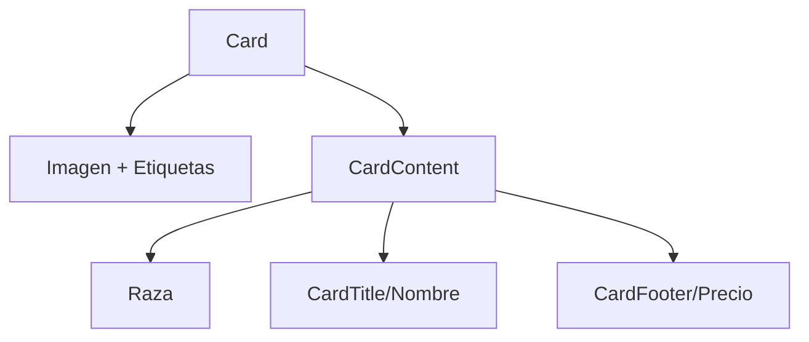

# Ejemplo de PuppyCard usando componentes de shadcn/ui

Este documento muestra cómo se vería el componente `PuppyCard` si se implementara utilizando los componentes de shadcn/ui. Esto te dará una idea clara de las diferencias y beneficios antes de decidir si quieres migrar.

## Implementación actual vs. Implementación con shadcn/ui

### Implementación actual:
```tsx
<article className="border border-border rounded-lg overflow-hidden bg-card hover:cursor-pointer">
  <div className="relative w-full">
    {/* Imagen y etiquetas */}
  </div>
  <div className="p-4">
    {/* Contenido de la tarjeta */}
  </div>
</article>
```

### Implementación con shadcn/ui:
```tsx
<Card className="overflow-hidden hover:cursor-pointer">
  <div className="relative w-full">
    {/* Imagen y etiquetas */}
  </div>
  <CardContent>
    {/* Contenido de la tarjeta */}
  </CardContent>
</Card>
```

## Ejemplo completo con shadcn/ui

Aquí tienes un ejemplo completo de cómo se vería tu `PuppyCard` implementado con los componentes de shadcn/ui:

```tsx
'use client'
import { cn } from '@/utilities/ui'
import useClickableCard from '@/utilities/useClickableCard'
import Link from 'next/link'
import React from 'react'

import { Media } from '@/components/Media'
import { Card, CardContent, CardTitle, CardFooter } from '@/components/ui/card'

export type CardPuppyData = {
  id?: string | number | null
  slug?: string | null
  name?: string | null
  breed?: any
  gender?: 'male' | 'female' | null
  mainImage?: any
  price?: number | null
  disponibilidad?: 'available' | 'reserved' | 'sold' | null
}

export const PuppyCard: React.FC<{
  className?: string
  doc?: CardPuppyData
  relationTo?: 'puppies'
  showBreed?: boolean
}> = (props) => {
  const { card, link } = useClickableCard({})
  const { className, doc, relationTo, showBreed } = props

  // Extraemos los datos con valores por defecto para evitar problemas
  const slug = doc?.slug || ''
  const name = doc?.name || 'Sin nombre'
  const gender = doc?.gender
  const mainImage = doc?.mainImage
  const price = doc?.price || 0
  const disponibilidad = doc?.disponibilidad || 'available'

  // Aseguramos que siempre tengamos un nombre de raza
  const breedName =
    doc?.breed && typeof doc.breed === 'object' ? doc.breed?.name : 'Raza no especificada'
  const genderText = gender === 'male' ? 'Macho' : gender === 'female' ? 'Hembra' : ''
  const href = `/${relationTo}/${slug}`

  // Texto y color según el estado
  const statusText =
    disponibilidad === 'available'
      ? 'Disponible'
      : disponibilidad === 'reserved'
        ? 'Reservado'
        : disponibilidad === 'sold'
          ? 'Vendido'
          : ''

  const statusColor =
    disponibilidad === 'available'
      ? 'bg-green-500'
      : disponibilidad === 'reserved'
        ? 'bg-yellow-500'
        : disponibilidad === 'sold'
          ? 'bg-red-500'
          : ''

  return (
    <Card
      className={cn('overflow-hidden hover:cursor-pointer', className)}
      ref={card.ref}
    >
      <div className="relative w-full">
        {!mainImage && (
          <div className="h-48 bg-gray-100 dark:bg-gray-800 flex items-center justify-center">
            No image
          </div>
        )}
        {mainImage && typeof mainImage !== 'string' && (
          <div className="relative w-full overflow-hidden">
            <Media resource={mainImage} size="" className="h-48 w-full object-cover" />
            <div className="absolute top-2 right-2 flex flex-col gap-2">
              {genderText && (
                <span
                  className={`px-2 py-1 rounded-full text-xs font-semibold ${
                    gender === 'male' ? 'bg-blue-500 text-white' : 'bg-pink-500 text-white'
                  }`}
                >
                  {genderText}
                </span>
              )}
              {statusText && (
                <span
                  className={`px-2 py-1 rounded-full text-xs font-semibold text-white ${statusColor}`}
                >
                  {statusText}
                </span>
              )}
            </div>
          </div>
        )}
      </div>
      <CardContent className="p-4">
        {showBreed && breedName && <div className="uppercase text-sm mb-2">{breedName}</div>}
        {name && (
          <div className="prose mb-2">
            <CardTitle className="mb-1 text-xl">
              <Link className="not-prose" href={href} ref={link.ref}>
                {name}
              </Link>
            </CardTitle>
          </div>
        )}
        <CardFooter className="p-0 pt-2">
          <div className="text-lg font-bold text-primary">{price.toLocaleString('es-ES')} €</div>
        </CardFooter>
      </CardContent>
    </Card>
  )
}
```

## Principales cambios y beneficios

1. **Componentes semánticos**: Uso de `Card`, `CardContent`, `CardTitle` y `CardFooter` que proporcionan una estructura más semántica y consistente.

2. **Menos clases CSS personalizadas**: Los componentes de shadcn/ui ya incluyen estilos base, por lo que necesitas menos clases personalizadas.

3. **Consistencia con el resto de la aplicación**: Si utilizas otros componentes de shadcn/ui, tendrás una apariencia más consistente en toda la aplicación.

4. **Mantenimiento más sencillo**: Los cambios de estilo globales se pueden aplicar más fácilmente a través del sistema de temas de shadcn/ui.

## Diagrama de la estructura del componente



## Plan de migración

Si decides migrar a los componentes de shadcn/ui, estos serían los pasos a seguir:

1. **Crear un componente de prueba**: Implementa una versión del `PuppyCard` con shadcn/ui en un archivo separado para probar su apariencia y funcionalidad.

2. **Comparar visualmente**: Asegúrate de que la nueva implementación se ve y funciona como esperas.

3. **Migración gradual**: Puedes migrar gradualmente reemplazando el componente actual por el nuevo en diferentes partes de la aplicación.

4. **Ajustes finales**: Realiza ajustes de estilo según sea necesario para mantener la coherencia con el diseño actual.
