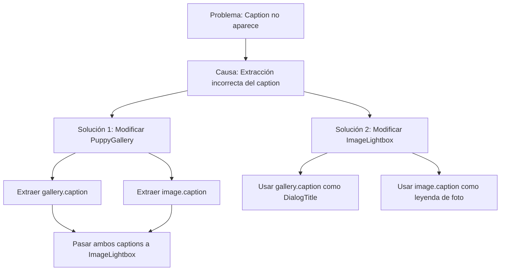

# Plan de Corrección de Captions en PuppyGallery y ImageLightbox

## Análisis del Problema

Actualmente, el componente PuppyGallery no está mostrando correctamente los captions en el lightbox debido a que:

1. La estructura de datos de la API tiene dos niveles de captions:
   - `gallery[0].caption` (a nivel de objeto de galería)
   - `gallery[0].image.caption` (a nivel de objeto de imagen)

2. El componente PuppyGallery solo está intentando extraer `item.caption`, pero no `item.image.caption`.

3. El componente ImageLightbox está configurado para mostrar un solo tipo de caption.

## Solución Propuesta

Modificar ambos componentes para:

1. En PuppyGallery:
   - Extraer tanto `item.caption` como `item.image.caption`
   - Pasar ambos captions al componente ImageLightbox

2. En ImageLightbox:
   - Usar `galleryCaption` para el DialogTitle (título del diálogo)
   - Usar `imageCaption` para la leyenda debajo de cada foto



## Implementación Detallada

### 1. Modificar el Componente PuppyGallery

#### 1.1 Actualizar la función `extractCaption`

La función actual solo extrae texto de un objeto rich text. Necesitamos modificarla para manejar la estructura específica de los captions:

```typescript
// Función para extraer texto de un posible objeto rich text
const extractRichText = (richText: any): string | undefined => {
  if (!richText) return undefined;

  // Si es un string, devolverlo directamente
  if (typeof richText === 'string') return richText;

  // Si es un objeto con estructura de rich text
  if (typeof richText === 'object') {
    // Si tiene una propiedad 'root' (formato típico de rich text)
    if (richText.root) {
      // Intentar extraer el texto del primer nodo de texto
      try {
        const firstParagraph = richText.root.children?.[0];
        if (firstParagraph && firstParagraph.children) {
          const firstTextNode = firstParagraph.children[0];
          if (firstTextNode && firstTextNode.text) {
            return firstTextNode.text;
          }
        }
      } catch (e) {
        console.error('Error extracting text from rich text:', e);
      }
    }

    // Si tiene una propiedad 'children' directamente
    if (richText.children && Array.isArray(richText.children)) {
      try {
        const texts = richText.children
          .filter((child: any) => child.type === 'text' && child.text)
          .map((child: any) => child.text);

        if (texts.length > 0) {
          return texts.join(' ');
        }
      } catch (e) {
        console.error('Error extracting text from children:', e);
      }
    }
  }

  return undefined;
};
```

#### 1.2 Modificar la construcción del array `allImages`

Modificar cómo se construye el array para extraer y pasar ambos captions:

```typescript
// Preparar las imágenes para el lightbox (incluir la imagen principal y la galería)
const allImages = [
  {
    image: mainImage,
    alt: `Imagen principal de ${puppyName}`,
    // No añadimos caption a la imagen principal para que no se muestre por defecto
  },
  ...(gallery?.map((item: any, index: number) => {
    // Extraer el caption a nivel de galería
    const galleryCaption = extractRichText(item.caption);

    // Extraer el caption a nivel de imagen
    const imageCaption = extractRichText(item.image?.caption);

    return {
      image: item.image,
      alt: `Imagen ${index + 1} de ${puppyName}`,
      galleryCaption: galleryCaption, // Caption para el título del diálogo
      imageCaption: imageCaption,     // Caption para la leyenda de la imagen
    };
  }) || []),
];
```

### 2. Modificar el Componente ImageLightbox

#### 2.1 Actualizar la interfaz `ImageType`

Modificar la interfaz para incluir ambos tipos de captions:

```typescript
type ImageType = {
  image: any;
  alt?: string;
  galleryCaption?: string; // Caption para el título del diálogo
  imageCaption?: string;   // Caption para la leyenda de la imagen
};
```

#### 2.2 Actualizar el componente para usar ambos captions

Modificar el componente para usar `galleryCaption` en el DialogTitle y `imageCaption` para la leyenda debajo de la foto:

```typescript
// Obtener la leyenda de la imagen actual para el título del diálogo
const currentGalleryCaption = images[currentIndex]?.galleryCaption ||
                             images[currentIndex]?.alt ||
                             `Imagen ${currentIndex + 1} de ${images.length}`;

// Título dinámico para el diálogo
const dialogTitle = `${title} - ${currentGalleryCaption}`;

// ...

// En el CarouselItem:
{/* Leyenda de la imagen - solo se muestra si existe un imageCaption específico */}
{image.imageCaption && (
  <div className="text-center p-2 bg-background/80 backdrop-blur-sm rounded-md mx-6 mb-4">
    <p className="text-sm text-foreground">{image.imageCaption}</p>
  </div>
)}
```

## Ventajas de esta Implementación

1. **Separación clara de responsabilidades**: Cada tipo de caption tiene un propósito específico.
2. **Compatibilidad con la estructura de datos actual**: La solución se adapta a la estructura de datos que devuelve la API.
3. **Flexibilidad**: Permite tener diferentes textos para el título del diálogo y la leyenda de la imagen.
4. **Mejora de la experiencia de usuario**: Proporciona más contexto tanto en el título del diálogo como en la leyenda de la imagen.

## Próximos Pasos

1. Implementar los cambios en el componente PuppyGallery.
2. Implementar los cambios en el componente ImageLightbox.
3. Probar la funcionalidad con datos reales de la API.
4. Verificar que los captions se muestren correctamente en ambas ubicaciones.
