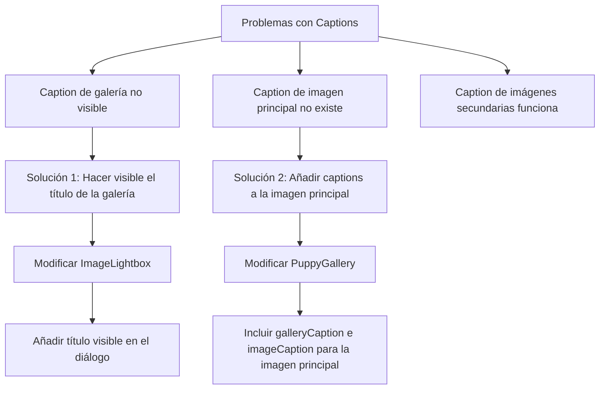
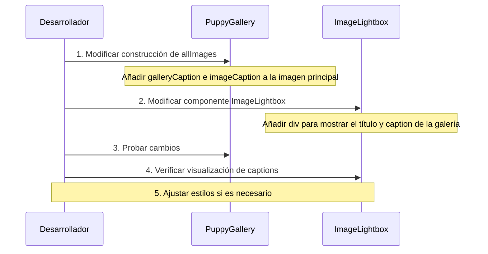

# Plan de Corrección para los Captions en PuppyGallery y ImageLightbox

## Análisis del Problema

Después de revisar el código de los componentes `PuppyGallery` e `ImageLightbox`, he identificado los siguientes problemas:

1. **El caption de la galería general no se ve**:
   - El `DialogTitle` que contiene el caption de la galería está configurado con la clase `sr-only`, lo que lo hace visible solo para lectores de pantalla pero no visualmente.
   - Aunque se está generando correctamente el `currentGalleryCaption` y el `dialogTitle`, este no se muestra visualmente en la interfaz.

2. **El caption de la imagen principal no aparece**:
   - En el componente `PuppyGallery`, cuando se construye el array `allImages`, para la imagen principal no se añade ningún caption (hay un comentario explícito: "No añadimos caption a la imagen principal para que no se muestre por defecto").
   - Esto hace que la imagen principal no tenga ni `galleryCaption` ni `imageCaption`.

3. **El caption de las imágenes secundarias sí aparece**:
   - Para las imágenes secundarias, se extraen correctamente tanto `galleryCaption` como `imageCaption`.
   - En `ImageLightbox`, la condición `{(image.imageCaption || image.caption) && (...)}` muestra el caption solo si existe `imageCaption` o `caption`.

## Solución Propuesta



## Implementación Detallada

### 1. Modificación del Componente ImageLightbox

Para hacer visible el título de la galería, necesitamos modificar el componente `ImageLightbox`:

```tsx
// src/components/ImageLightbox/index.tsx
export function ImageLightbox({
  images,
  initialIndex = 0,
  open,
  onOpenChange,
  title = 'Galería de imágenes',
}: ImageLightboxProps) {
  // ... código existente ...

  return (
    <Dialog open={open} onOpenChange={onOpenChange}>
      <DialogContent className="max-w-screen-lg p-0 border-none bg-transparent">
        {/* Título accesible pero visualmente oculto */}
        <DialogTitle className="sr-only">{dialogTitle}</DialogTitle>

        {/* Título visible para todos los usuarios */}
        <div className="text-center p-2 bg-background/80 backdrop-blur-sm rounded-md mx-6 mt-4 mb-2">
          <h2 className="text-lg font-semibold text-foreground">{title}</h2>
          {currentGalleryCaption && (
            <p className="text-sm text-muted-foreground">{currentGalleryCaption}</p>
          )}
        </div>

        <Carousel
          setApi={setApi}
          className="w-full max-h-[80vh]"
          opts={{
            align: "center",
            loop: true,
            startIndex: initialIndex,
            skipSnaps: true,
          }}
        >
          <CarouselContent>
            {images.map((image, index) => (
              <CarouselItem key={index} className="flex flex-col items-center justify-center">
                {/* Contenedor de la imagen */}
                <div className="relative w-full h-full max-h-[70vh] flex items-center justify-center p-6">
                  {/* ... código existente ... */}
                </div>

                {/* Leyenda de la imagen - solo se muestra si existe un imageCaption o caption específico */}
                {(image.imageCaption || image.caption) && (
                  <div className="text-center p-2 bg-background/80 backdrop-blur-sm rounded-md mx-6 mb-4">
                    <p className="text-sm text-foreground">{image.imageCaption || image.caption}</p>
                  </div>
                )}
              </CarouselItem>
            ))}
          </CarouselContent>
          {/* ... código existente ... */}
        </Carousel>
      </DialogContent>
    </Dialog>
  );
}
```

### 2. Modificación del Componente PuppyGallery

Para añadir captions a la imagen principal, necesitamos modificar cómo se construye el array `allImages` en el componente `PuppyGallery`:

```tsx
// src/components/PuppyGallery/index.tsx
export function PuppyGallery({
  mainImage,
  gallery = [],
  puppyName = 'Cachorro',
}: PuppyGalleryProps) {
  // ... código existente ...

  // Preparar las imágenes para el lightbox (incluir la imagen principal y la galería)
  const allImages = [
    {
      image: mainImage,
      alt: `Imagen principal de ${puppyName}`,
      galleryCaption: `Galería de ${puppyName}`, // Caption para el título del diálogo
      imageCaption: `Imagen principal de ${puppyName}`, // Caption para la leyenda de la imagen
    },
    ...(gallery?.map((item: any, index: number) => {
      // El caption a nivel de galería es un string, lo usamos directamente
      const galleryCaption = item.caption;

      // El caption a nivel de imagen es un objeto rich text, necesitamos extraer el texto
      const imageCaption = extractRichText(item.image?.caption);

      return {
        image: item.image,
        alt: `Imagen ${index + 1} de ${puppyName}`,
        galleryCaption: galleryCaption, // Caption para el título del diálogo
        imageCaption: imageCaption, // Caption para la leyenda de la imagen
      };
    }) || []),
  ];

  // ... resto del código ...
}
```

## Pasos de Implementación



## Ventajas de esta Implementación

1. **Visibilidad mejorada**: El título de la galería será visible para todos los usuarios, no solo para los que usan lectores de pantalla.
2. **Consistencia**: Todas las imágenes, incluida la principal, tendrán captions.
3. **Experiencia de usuario mejorada**: Los usuarios tendrán más contexto sobre lo que están viendo.
4. **Accesibilidad mantenida**: Se mantiene el `DialogTitle` con clase `sr-only` para la accesibilidad.

## Consideraciones Adicionales

- **Estilos**: Es posible que sea necesario ajustar los estilos para asegurar que el nuevo título visible se integre bien con el diseño existente.
- **Responsividad**: Asegurar que el título y los captions se vean bien en diferentes tamaños de pantalla.
- **Internacionalización**: Si la aplicación soporta múltiples idiomas, asegurar que los textos estáticos como "Galería de imágenes" estén preparados para la traducción.

## Próximos Pasos

1. Implementar los cambios en el componente `ImageLightbox`.
2. Implementar los cambios en el componente `PuppyGallery`.
3. Probar la funcionalidad para asegurar que:
   - El título de la galería sea visible.
   - El caption de la imagen principal aparezca.
   - Los captions de las imágenes secundarias sigan funcionando correctamente.
4. Realizar ajustes de estilo si es necesario.
