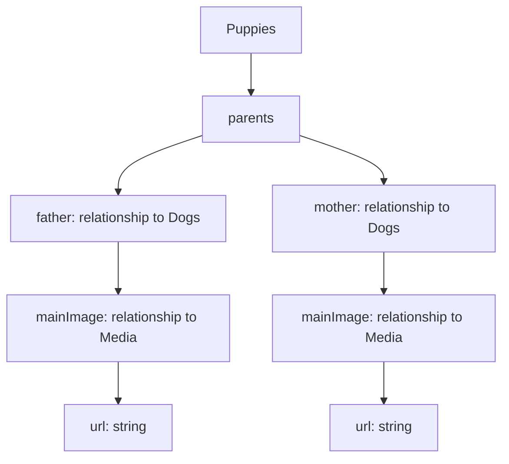

# Plan de Corrección: Imágenes de Padres en la Pestaña de Padres

## Problema Identificado

Después de analizar el código, se han identificado dos problemas principales:

1. **Referencia incorrecta a las imágenes de los padres**: En el componente `PuppyParentsTab` se está intentando acceder a `parents.father.image` y `parents.mother.image`, pero según la estructura de datos de la colección Dogs, debería ser `parents.father.mainImage` y `parents.mother.mainImage`.

2. **Archivo placeholder.svg faltante**: El archivo placeholder.svg no existe en la carpeta public, lo que causa los errores 404 cuando se intenta mostrar una imagen de placeholder.

## Solución Propuesta

### 1. Modificar el componente PuppyParentsTab

Cambiar las referencias de `image` a `mainImage` en el componente para que coincidan con la estructura de datos de la colección `Dogs`.

```jsx
// Código actual (con error)
{parents.father && parents.father.image && typeof parents.father.image === 'object' ? (
  <Media
    resource={parents.father.image}
    fill
    className="object-cover"
    alt={`Padre de ${getSafeText(puppyName, 'cachorro')}`}
  />
) : (
  <Image
    src="/placeholder.svg?height=200&width=300"
    alt="Padre del cachorro"
    fill
    className="object-cover"
  />
)}

// Código corregido
{parents.father && parents.father.mainImage && typeof parents.father.mainImage === 'object' ? (
  <Media
    resource={parents.father.mainImage}
    fill
    className="object-cover"
    alt={`Padre de ${getSafeText(puppyName, 'cachorro')}`}
  />
) : (
  <Image
    src="/placeholder.svg?height=200&width=300"
    alt="Padre del cachorro"
    fill
    className="object-cover"
  />
)}
```

Hacer el mismo cambio para la madre:

```jsx
// Código actual (con error)
{parents.mother && parents.mother.image && typeof parents.mother.image === 'object' ? (
  <Media
    resource={parents.mother.image}
    fill
    className="object-cover"
    alt={`Madre de ${getSafeText(puppyName, 'cachorro')}`}
  />
) : (
  <Image
    src="/placeholder.svg?height=200&width=300"
    alt="Madre del cachorro"
    fill
    className="object-cover"
  />
)}

// Código corregido
{parents.mother && parents.mother.mainImage && typeof parents.mother.mainImage === 'object' ? (
  <Media
    resource={parents.mother.mainImage}
    fill
    className="object-cover"
    alt={`Madre de ${getSafeText(puppyName, 'cachorro')}`}
  />
) : (
  <Image
    src="/placeholder.svg?height=200&width=300"
    alt="Madre del cachorro"
    fill
    className="object-cover"
  />
)}
```

### 2. Crear el archivo placeholder.svg

Crear un archivo SVG simple para usar como placeholder en la carpeta `public`:

```svg
<svg width="300" height="200" xmlns="http://www.w3.org/2000/svg">
  <rect width="100%" height="100%" fill="#f0f0f0"/>
  <text x="50%" y="50%" font-family="Arial" font-size="20" text-anchor="middle" dominant-baseline="middle" fill="#888">Imagen no disponible</text>
</svg>
```

## Estructura de Datos



## Pasos de Implementación

1. Modificar el archivo `src/components/PuppyParentsTab/index.tsx` para cambiar las referencias de `image` a `mainImage`.
2. Crear el archivo `public/placeholder.svg` con el contenido SVG proporcionado.
3. Verificar que las imágenes de los padres se muestren correctamente en la pestaña de padres.

## Notas Adicionales

- La estructura de datos de la colección `Dogs` muestra que cada perro tiene un campo `mainImage` que es una relación con la colección `media`.
- Cuando se consulta un cachorro con `depth: 2` (como se hace en la función `queryPuppyBySlug`), se obtienen los datos de los padres, pero es necesario acceder correctamente a sus imágenes.
