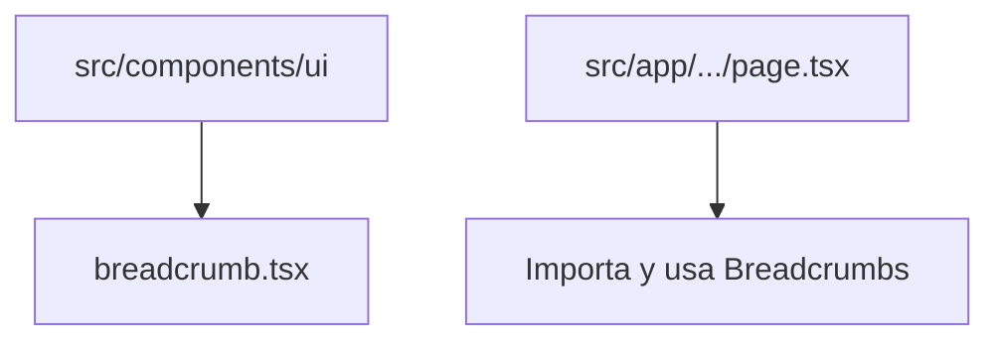
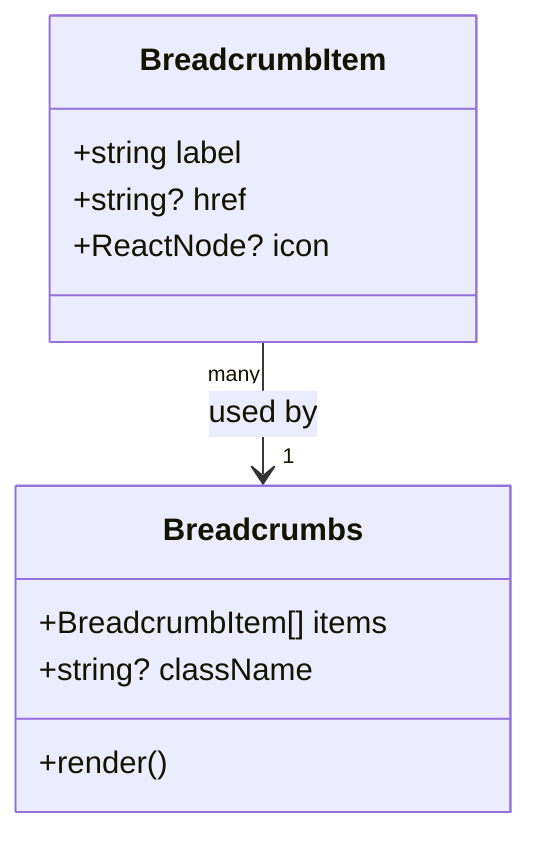

# Plan de Implementación: Componente Breadcrumbs Reutilizable

## 1. Contexto y Problema

Actualmente, las breadcrumbs (migas de pan) están implementadas directamente en la página de detalles de cachorros (`src/app/(frontend)/puppies/[slug]/page.tsx`). Esto limita su reutilización en otras secciones del sitio y dificulta mantener una apariencia y comportamiento consistentes en toda la aplicación.

## 2. Solución Propuesta

Crear un componente reutilizable de breadcrumbs que pueda ser utilizado en cualquier página del sitio, manteniendo la consistencia visual y mejorando la mantenibilidad del código.

## 3. Estructura del Componente

Crearemos un nuevo archivo `breadcrumb.tsx` en la carpeta `src/components/ui` que contendrá nuestro componente reutilizable.



## 4. Definición de Tipos

Definiremos los tipos necesarios para el componente:

```typescript
// Tipo para cada elemento de la miga de pan
type BreadcrumbItem = {
  label: string;         // Texto a mostrar
  href?: string;         // Enlace (opcional)
  icon?: React.ReactNode; // Icono (opcional)
};

// Props para el componente Breadcrumbs
interface BreadcrumbsProps {
  items: BreadcrumbItem[]; // Lista de elementos
  className?: string;      // Clases CSS adicionales (opcional)
}
```

## 5. Implementación del Componente

El componente completo sería así:

```tsx
import React from 'react';
import { ChevronRight } from 'lucide-react';

type BreadcrumbItem = {
  label: string;
  href?: string;
  icon?: React.ReactNode;
};

interface BreadcrumbsProps {
  items: BreadcrumbItem[];
  className?: string;
}

export function Breadcrumbs({ items, className }: BreadcrumbsProps) {
  return (
    <nav className={`flex text-sm ${className || ''}`} aria-label="Breadcrumb">
      <ol className="flex items-center space-x-2">
        {items.map((item, index) => (
          <React.Fragment key={index}>
            {/* Añadir separador ChevronRight entre elementos */}
            {index > 0 && (
              <li className="flex items-center">
                <ChevronRight className="h-4 w-4 text-muted-foreground" />
              </li>
            )}

            {/* Elemento de breadcrumb */}
            <li className={index === items.length - 1 ? "text-foreground font-medium" : ""}>
              {item.href && index !== items.length - 1 ? (
                <a
                  href={item.href}
                  className="text-muted-foreground hover:text-foreground flex items-center"
                >
                  {item.icon && <span className="mr-1">{item.icon}</span>}
                  <span>{item.label}</span>
                </a>
              ) : (
                <span
                  className="flex items-center"
                  aria-current={index === items.length - 1 ? "page" : undefined}
                >
                  {item.icon && <span className="mr-1">{item.icon}</span>}
                  <span>{item.label}</span>
                </span>
              )}
            </li>
          </React.Fragment>
        ))}
      </ol>
    </nav>
  );
}
```

## 6. Uso en la Página de Puppies

Para usar el componente en la página de puppies, modificaríamos el código actual:

```tsx
import { Breadcrumbs } from '@/components/ui/breadcrumb';
import { Home } from 'lucide-react';

// Dentro del componente Page
return (
  <div className="container mx-auto px-4 py-8">
    <Breadcrumbs
      className="mb-6"
      items={[
        {
          label: 'Home',
          href: '/',
          icon: <Home className="h-4 w-4" />
        },
        {
          label: 'Cachorros',
          href: '/puppies'
        },
        {
          label: breed?.name || 'Cachorro'
        }
      ]}
    />
    {/* Resto del contenido */}
  </div>
);
```

## 7. Ventajas de Este Enfoque

1. **Reutilización**: El componente puede usarse en cualquier página del sitio
2. **Consistencia**: Mantiene un estilo y comportamiento uniforme en toda la aplicación
3. **Mantenibilidad**: Si necesitas cambiar el diseño o comportamiento de las breadcrumbs, solo necesitas modificar un archivo
4. **Flexibilidad**: Puedes personalizar cada nivel con iconos, enlaces, etc.
5. **Accesibilidad**: Mantiene las etiquetas semánticas y atributos ARIA para accesibilidad
6. **Escalabilidad**: Fácil de extender con nuevas funcionalidades

## 8. Posibles Mejoras Futuras

1. **Integración con Next.js Router**:
   - Crear un hook personalizado que genere automáticamente las breadcrumbs basadas en la estructura de carpetas y rutas de Next.js

2. **Persistencia de Navegación**:
   - Implementar un sistema para guardar la "ruta de migas" en el estado global o localStorage para mantener el contexto entre navegaciones

3. **Personalización Avanzada**:
   - Añadir opciones para personalizar los separadores
   - Permitir diferentes estilos visuales (compacto, expandido, etc.)

4. **Animaciones**:
   - Añadir transiciones suaves entre cambios de ruta

## 9. Diagrama de Componentes



## 10. Pasos para la Implementación

1. Crear el archivo `src/components/ui/breadcrumb.tsx`
2. Implementar el componente con los tipos y la lógica descritos
3. Modificar la página de puppies para usar el nuevo componente
4. Probar la funcionalidad para asegurar que se comporta igual que antes
5. Implementar el componente en otras páginas donde sea necesario
