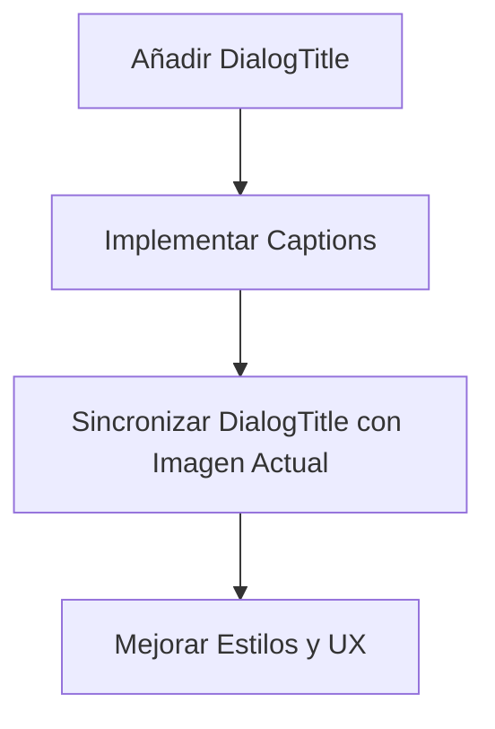

# Plan de Implementación de Captions y Título Accesible para el Lightbox

## Análisis del Problema

Actualmente, tenemos dos requisitos para mejorar nuestro componente de lightbox:

1. **Accesibilidad**: El componente `DialogContent` de Radix UI requiere un `DialogTitle` para ser accesible para los usuarios de lectores de pantalla.
2. **Leyendas (Captions)**: El usuario desea añadir leyendas debajo de cada imagen en el lightbox.

El desafío es que el `DialogTitle` es único para todo el diálogo, mientras que cada imagen tendría su propia leyenda.

## Solución Propuesta

Implementaremos una solución que:

1. Utilice un `DialogTitle` dinámico que se actualice según la imagen actual mostrada.
2. Muestre leyendas visibles debajo de cada imagen.
3. Mantenga la accesibilidad y la experiencia de usuario.



## Implementación Detallada

### 1. Modificar el Componente ImageLightbox

Modificaremos el componente para:

- Añadir un `DialogTitle` que se actualice dinámicamente.
- Añadir leyendas debajo de cada imagen.
- Rastrear el índice de la imagen actual para actualizar el título.

```tsx
'use client'

import React, { useState, useEffect } from 'react'
import Image from 'next/image'
import {
  Dialog,
  DialogContent,
  DialogTitle
} from '@/components/ui/dialog'
import { Media } from '@/components/Media'
import {
  Carousel,
  CarouselContent,
  CarouselItem,
  CarouselNext,
  CarouselPrevious,
  type CarouselApi
} from "@/components/ui/carousel"

type ImageType = {
  image: any
  alt?: string
  caption?: string
}

interface ImageLightboxProps {
  images: ImageType[]
  initialIndex?: number
  open: boolean
  onOpenChange: (open: boolean) => void
  title?: string
}

export function ImageLightbox({
  images,
  initialIndex = 0,
  open,
  onOpenChange,
  title = "Galería de imágenes"
}: ImageLightboxProps) {
  const [api, setApi] = useState<CarouselApi>()
  const [currentIndex, setCurrentIndex] = useState(initialIndex)

  // Actualizar el índice actual cuando cambia el carrusel
  useEffect(() => {
    if (!api) return

    const onSelect = () => {
      setCurrentIndex(api.selectedScrollSnap())
    }

    api.on("select", onSelect)
    return () => {
      api.off("select", onSelect)
    }
  }, [api])

  if (!images || images.length === 0) return null

  // Obtener la leyenda de la imagen actual o usar un valor por defecto
  const currentCaption = images[currentIndex]?.caption ||
                        images[currentIndex]?.alt ||
                        `Imagen ${currentIndex + 1} de ${images.length}`

  // Título dinámico para el diálogo
  const dialogTitle = `${title} - ${currentCaption}`

  return (
    <Dialog open={open} onOpenChange={onOpenChange}>
      <DialogContent className="max-w-screen-lg p-0 border-none bg-transparent">
        {/* Título accesible pero visualmente oculto */}
        <DialogTitle className="sr-only">
          {dialogTitle}
        </DialogTitle>

        <Carousel
          setApi={setApi}
          className="w-full max-h-[80vh]"
          opts={{
            align: "center",
            loop: true,
            startIndex: initialIndex,
            skipSnaps: true,
          }}
        >
          <CarouselContent>
            {images.map((image, index) => (
              <CarouselItem key={index} className="flex flex-col items-center justify-center">
                {/* Contenedor de la imagen */}
                <div className="relative w-full h-full max-h-[70vh] flex items-center justify-center p-6">
                  {image.image ? (
                    <Media
                      resource={image.image}
                      className="object-contain max-h-[65vh] w-auto"
                      alt={image.alt || `Imagen ${index + 1}`}
                    />
                  ) : (
                    <Image
                      src="/placeholder.svg?height=600&width=600"
                      alt={image.alt || `Imagen ${index + 1}`}
                      width={600}
                      height={600}
                      className="object-contain max-h-[65vh]"
                    />
                  )}
                </div>

                {/* Leyenda de la imagen */}
                {(image.caption || image.alt) && (
                  <div className="text-center p-2 bg-background/80 backdrop-blur-sm rounded-md mx-6 mb-4">
                    <p className="text-sm text-foreground">
                      {image.caption || image.alt}
                    </p>
                  </div>
                )}
              </CarouselItem>
            ))}
          </CarouselContent>
          <CarouselPrevious
            className="left-4 bg-background/80 backdrop-blur-sm hover:bg-background/90 border-none h-10 w-10"
            aria-label="Imagen anterior"
          />
          <CarouselNext
            className="right-4 bg-background/80 backdrop-blur-sm hover:bg-background/90 border-none h-10 w-10"
            aria-label="Imagen siguiente"
          />
        </Carousel>
      </DialogContent>
    </Dialog>
  )
}
```

### 2. Modificar el Componente PuppyGallery

Necesitamos actualizar el componente PuppyGallery para pasar las leyendas a las imágenes:

```tsx
// En src/components/PuppyGallery/index.tsx

// Modificar la preparación de imágenes para incluir captions
const allImages = [
  {
    image: mainImage,
    alt: `Imagen principal de ${puppyName}`,
    caption: `Imagen principal de ${puppyName}`
  },
  ...(gallery?.map((item: any, index: number) => ({
    image: item.image,
    alt: `Imagen ${index + 1} de ${puppyName}`,
    caption: item.caption || `Imagen ${index + 1} de ${puppyName}`
  })) || [])
]
```

### 3. Consideraciones de Accesibilidad

Esta implementación mejora la accesibilidad de varias maneras:

1. **DialogTitle dinámico**: Proporciona contexto a los usuarios de lectores de pantalla sobre qué imagen están viendo.
2. **Leyendas visibles**: Mejora la experiencia para todos los usuarios proporcionando contexto visual.
3. **Atributos alt**: Asegura que todas las imágenes tengan textos alternativos adecuados.

## Ventajas de esta Implementación

1. **Accesibilidad mejorada**: Cumple con los requisitos de accesibilidad de Radix UI.
2. **Experiencia de usuario enriquecida**: Las leyendas proporcionan contexto adicional para cada imagen.
3. **Flexibilidad**: El sistema permite leyendas personalizadas para cada imagen o generarlas automáticamente.
4. **Mantenimiento de la UX**: Conserva la funcionalidad de navegación instantánea a la imagen seleccionada.

## Próximos Pasos

1. Implementar el componente ImageLightbox actualizado.
2. Modificar el componente PuppyGallery para pasar las leyendas.
3. Probar la accesibilidad con herramientas como lectores de pantalla.
4. Ajustar estilos según sea necesario para una experiencia visual óptima.
