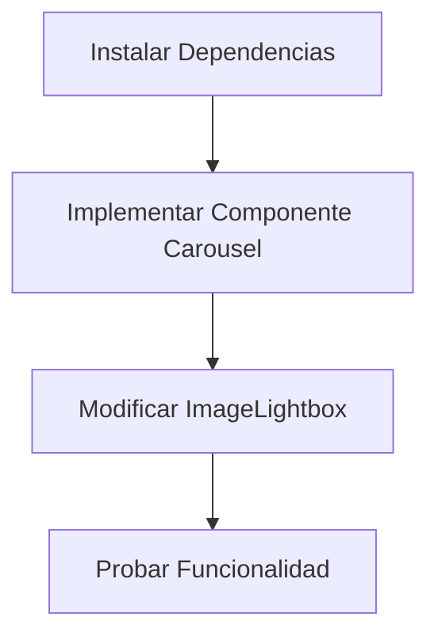

# Plan de Implementación del Componente Carousel para el Lightbox

## Análisis de la Situación Actual

Actualmente, hemos implementado un lightbox básico que permite ver imágenes a pantalla completa y navegar entre ellas mediante botones y controles de teclado. Sin embargo, podemos mejorar significativamente la experiencia de usuario implementando el componente Carousel de Shadcn UI, que proporcionará:

- Transiciones suaves entre imágenes
- Gestos táctiles para dispositivos móviles
- Mejor accesibilidad
- Experiencia de navegación más intuitiva

## Pasos para la Implementación



### 1. Instalar Dependencias Necesarias

El componente Carousel de Shadcn UI utiliza Embla Carousel como base. Necesitaremos instalar:

```bash
pnpm add embla-carousel-react
```

### 2. Implementar el Componente Carousel de Shadcn UI

Crearemos el componente en `src/components/ui/carousel.tsx` siguiendo la implementación oficial de Shadcn UI.

### 3. Modificar el Componente ImageLightbox

Adaptaremos nuestro componente ImageLightbox para utilizar el nuevo componente Carousel, manteniendo la funcionalidad de lightbox.

### 4. Probar la Funcionalidad

Verificaremos que todo funcione correctamente en diferentes dispositivos y navegadores.

## Implementación Detallada

### Componente Carousel de Shadcn UI

```tsx
// src/components/ui/carousel.tsx
"use client"

import * as React from "react"
import useEmblaCarousel, {
  type UseEmblaCarouselType,
} from "embla-carousel-react"
import { ArrowLeft, ArrowRight } from "lucide-react"

import { cn } from "@/utilities/ui"
import { Button } from "@/components/ui/button"

type CarouselApi = UseEmblaCarouselType[1]
type UseCarouselParameters = Parameters<typeof useEmblaCarousel>
type CarouselOptions = UseCarouselParameters[0]
type CarouselPlugin = UseCarouselParameters[1]

type CarouselProps = {
  opts?: CarouselOptions
  plugins?: CarouselPlugin
  orientation?: "horizontal" | "vertical"
  setApi?: (api: CarouselApi) => void
}

type CarouselContextProps = {
  carouselRef: ReturnType<typeof useEmblaCarousel>[0]
  api: ReturnType<typeof useEmblaCarousel>[1]
  scrollPrev: () => void
  scrollNext: () => void
  canScrollPrev: boolean
  canScrollNext: boolean
} & CarouselProps

const CarouselContext = React.createContext<CarouselContextProps | null>(null)

function useCarousel() {
  const context = React.useContext(CarouselContext)

  if (!context) {
    throw new Error("useCarousel must be used within a <Carousel />")
  }

  return context
}

const Carousel = React.forwardRef<
  HTMLDivElement,
  React.HTMLAttributes<HTMLDivElement> & CarouselProps
>(
  (
    {
      orientation = "horizontal",
      opts,
      setApi,
      plugins,
      className,
      children,
      ...props
    },
    ref
  ) => {
    const [carouselRef, api] = useEmblaCarousel(
      {
        ...opts,
        axis: orientation === "horizontal" ? "x" : "y",
      },
      plugins
    )
    const [canScrollPrev, setCanScrollPrev] = React.useState(false)
    const [canScrollNext, setCanScrollNext] = React.useState(false)

    const onSelect = React.useCallback((api: CarouselApi) => {
      if (!api) {
        return
      }

      setCanScrollPrev(api.canScrollPrev())
      setCanScrollNext(api.canScrollNext())
    }, [])

    const scrollPrev = React.useCallback(() => {
      api?.scrollPrev()
    }, [api])

    const scrollNext = React.useCallback(() => {
      api?.scrollNext()
    }, [api])

    const handleKeyDown = React.useCallback(
      (event: React.KeyboardEvent<HTMLDivElement>) => {
        if (event.key === "ArrowLeft") {
          event.preventDefault()
          scrollPrev()
        } else if (event.key === "ArrowRight") {
          event.preventDefault()
          scrollNext()
        }
      },
      [scrollPrev, scrollNext]
    )

    React.useEffect(() => {
      if (!api || !setApi) {
        return
      }

      setApi(api)
    }, [api, setApi])

    React.useEffect(() => {
      if (!api) {
        return
      }

      onSelect(api)
      api.on("select", onSelect)
      api.on("reInit", onSelect)

      return () => {
        api.off("select", onSelect)
        api.off("reInit", onSelect)
      }
    }, [api, onSelect])

    return (
      <CarouselContext.Provider
        value={{
          carouselRef,
          api,
          opts,
          orientation,
          scrollPrev,
          scrollNext,
          canScrollPrev,
          canScrollNext,
        }}
      >
        <div
          ref={ref}
          onKeyDownCapture={handleKeyDown}
          className={cn("relative", className)}
          role="region"
          aria-roledescription="carousel"
          {...props}
        >
          {children}
        </div>
      </CarouselContext.Provider>
    )
  }
)
Carousel.displayName = "Carousel"

const CarouselContent = React.forwardRef<
  HTMLDivElement,
  React.HTMLAttributes<HTMLDivElement>
>(({ className, ...props }, ref) => {
  const { carouselRef, orientation } = useCarousel()

  return (
    <div ref={carouselRef} className="overflow-hidden">
      <div
        ref={ref}
        className={cn(
          "flex",
          orientation === "horizontal" ? "-ml-4" : "-mt-4 flex-col",
          className
        )}
        {...props}
      />
    </div>
  )
})
CarouselContent.displayName = "CarouselContent"

const CarouselItem = React.forwardRef<
  HTMLDivElement,
  React.HTMLAttributes<HTMLDivElement>
>(({ className, ...props }, ref) => {
  const { orientation } = useCarousel()

  return (
    <div
      ref={ref}
      role="group"
      aria-roledescription="slide"
      className={cn(
        "min-w-0 shrink-0 grow-0 basis-full",
        orientation === "horizontal" ? "pl-4" : "pt-4",
        className
      )}
      {...props}
    />
  )
})
CarouselItem.displayName = "CarouselItem"

const CarouselPrevious = React.forwardRef<
  HTMLButtonElement,
  React.ComponentProps<typeof Button>
>(({ className, variant = "outline", size = "icon", ...props }, ref) => {
  const { orientation, scrollPrev, canScrollPrev } = useCarousel()

  return (
    <Button
      ref={ref}
      variant={variant}
      size={size}
      className={cn(
        "absolute h-8 w-8 rounded-full",
        orientation === "horizontal"
          ? "left-2 top-1/2 -translate-y-1/2"
          : "left-1/2 top-2 -translate-x-1/2 rotate-90",
        className
      )}
      disabled={!canScrollPrev}
      onClick={scrollPrev}
      {...props}
    >
      <ArrowLeft className="h-4 w-4" />
      <span className="sr-only">Previous slide</span>
    </Button>
  )
})
CarouselPrevious.displayName = "CarouselPrevious"

const CarouselNext = React.forwardRef<
  HTMLButtonElement,
  React.ComponentProps<typeof Button>
>(({ className, variant = "outline", size = "icon", ...props }, ref) => {
  const { orientation, scrollNext, canScrollNext } = useCarousel()

  return (
    <Button
      ref={ref}
      variant={variant}
      size={size}
      className={cn(
        "absolute h-8 w-8 rounded-full",
        orientation === "horizontal"
          ? "right-2 top-1/2 -translate-y-1/2"
          : "bottom-2 left-1/2 -translate-x-1/2 rotate-90",
        className
      )}
      disabled={!canScrollNext}
      onClick={scrollNext}
      {...props}
    >
      <ArrowRight className="h-4 w-4" />
      <span className="sr-only">Next slide</span>
    </Button>
  )
})
CarouselNext.displayName = "CarouselNext"

export {
  type CarouselApi,
  Carousel,
  CarouselContent,
  CarouselItem,
  CarouselPrevious,
  CarouselNext,
}
```

### Modificación del Componente ImageLightbox

```tsx
// src/components/ImageLightbox/index.tsx
'use client'

import React, { useState, useEffect } from 'react'
import Image from 'next/image'
import {
  Dialog,
  DialogContent
} from '@/components/ui/dialog'
import { Media } from '@/components/Media'
import {
  Carousel,
  CarouselContent,
  CarouselItem,
  CarouselNext,
  CarouselPrevious,
} from "@/components/ui/carousel"

type ImageType = {
  image: any
  alt?: string
}

interface ImageLightboxProps {
  images: ImageType[]
  initialIndex?: number
  open: boolean
  onOpenChange: (open: boolean) => void
}

export function ImageLightbox({
  images,
  initialIndex = 0,
  open,
  onOpenChange
}: ImageLightboxProps) {
  const [api, setApi] = useState<any>(null)

  // Navegar al índice inicial cuando se abre el lightbox
  useEffect(() => {
    if (open && api) {
      api.scrollTo(initialIndex)
    }
  }, [open, initialIndex, api])

  if (!images || images.length === 0) return null

  return (
    <Dialog open={open} onOpenChange={onOpenChange}>
      <DialogContent className="max-w-screen-lg p-0 border-none bg-transparent">
        <Carousel
          setApi={setApi}
          className="w-full max-h-[80vh]"
          opts={{
            align: "center",
            loop: true,
          }}
        >
          <CarouselContent>
            {images.map((image, index) => (
              <CarouselItem key={index} className="flex items-center justify-center">
                <div className="relative w-full h-full max-h-[80vh] flex items-center justify-center p-6">
                  {image.image ? (
                    <Media
                      resource={image.image}
                      className="object-contain max-h-[70vh] w-auto"
                      alt={image.alt || 'Imagen de cachorro'}
                    />
                  ) : (
                    <Image
                      src="/placeholder.svg?height=600&width=600"
                      alt={image.alt || 'Imagen de cachorro'}
                      width={600}
                      height={600}
                      className="object-contain max-h-[70vh]"
                    />
                  )}
                </div>
              </CarouselItem>
            ))}
          </CarouselContent>
          <CarouselPrevious
            className="left-4 bg-background/80 backdrop-blur-sm hover:bg-background/90 border-none h-10 w-10"
            aria-label="Imagen anterior"
          />
          <CarouselNext
            className="right-4 bg-background/80 backdrop-blur-sm hover:bg-background/90 border-none h-10 w-10"
            aria-label="Imagen siguiente"
          />
        </Carousel>
      </DialogContent>
    </Dialog>
  )
}
```

## Ventajas de esta Implementación

1. **Experiencia de usuario mejorada**: Transiciones suaves entre imágenes y navegación más intuitiva.
2. **Soporte para dispositivos móviles**: Gestos táctiles para deslizar entre imágenes.
3. **Mejor accesibilidad**: Componentes con roles ARIA adecuados y navegación por teclado.
4. **Consistencia con el diseño**: Utiliza el mismo estilo y comportamiento que otros componentes de Shadcn UI.
