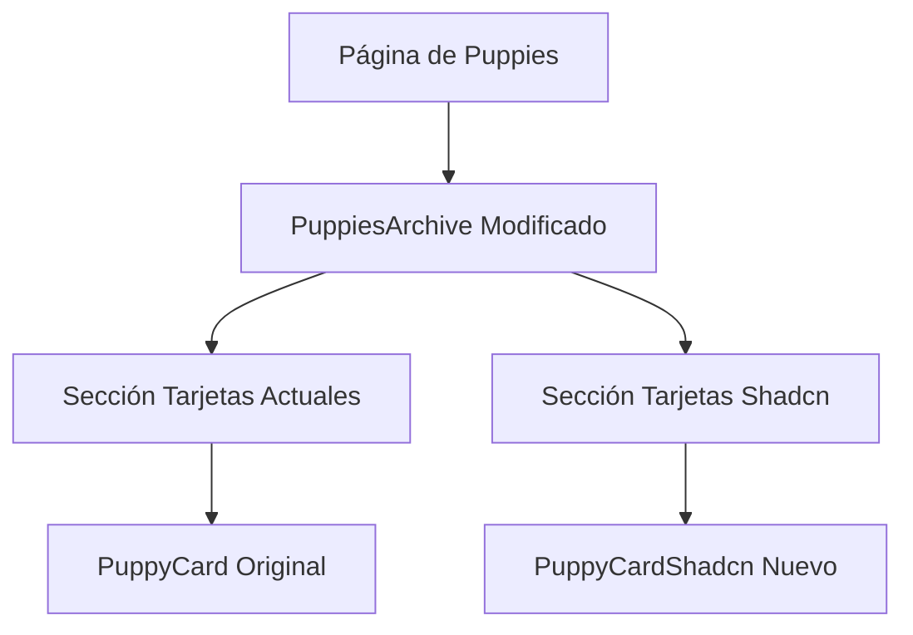

# Plan de implementación: Comparativa de tarjetas en la página de puppies

Este documento detalla cómo implementar una comparativa visual entre las tarjetas actuales y las tarjetas usando shadcn/ui en la página de puppies.

## Resumen del plan

1. Crear un nuevo componente `PuppyCardShadcn` usando los componentes de shadcn/ui
2. Modificar el componente `PuppiesArchive` para mostrar ambos tipos de tarjetas
3. Actualizar la página de puppies para incluir un título explicativo

## Diagrama de la solución



## Pasos detallados

### 1. Crear el componente PuppyCardShadcn

Crea un nuevo archivo en `src/components/Card/PuppyCardShadcn.tsx` con el siguiente contenido:

```tsx
'use client'
import { cn } from '@/utilities/ui'
import useClickableCard from '@/utilities/useClickableCard'
import Link from 'next/link'
import React from 'react'

import { Media } from '@/components/Media'
import { Card, CardContent, CardTitle, CardFooter } from '@/components/ui/card'

export type CardPuppyData = {
  id?: string | number | null
  slug?: string | null
  name?: string | null
  breed?: any
  gender?: 'male' | 'female' | null
  mainImage?: any
  price?: number | null
  disponibilidad?: 'available' | 'reserved' | 'sold' | null
}

export const PuppyCardShadcn: React.FC<{
  className?: string
  doc?: CardPuppyData
  relationTo?: 'puppies'
  showBreed?: boolean
}> = (props) => {
  const { card, link } = useClickableCard({})
  const { className, doc, relationTo, showBreed } = props

  // Extraemos los datos con valores por defecto para evitar problemas
  const slug = doc?.slug || ''
  const name = doc?.name || 'Sin nombre'
  const gender = doc?.gender
  const mainImage = doc?.mainImage
  const price = doc?.price || 0
  const disponibilidad = doc?.disponibilidad || 'available'

  // Aseguramos que siempre tengamos un nombre de raza
  const breedName =
    doc?.breed && typeof doc.breed === 'object' ? doc.breed?.name : 'Raza no especificada'
  const genderText = gender === 'male' ? 'Macho' : gender === 'female' ? 'Hembra' : ''
  const href = `/${relationTo}/${slug}`

  // Texto y color según el estado
  const statusText =
    disponibilidad === 'available'
      ? 'Disponible'
      : disponibilidad === 'reserved'
        ? 'Reservado'
        : disponibilidad === 'sold'
          ? 'Vendido'
          : ''

  const statusColor =
    disponibilidad === 'available'
      ? 'bg-green-500'
      : disponibilidad === 'reserved'
        ? 'bg-yellow-500'
        : disponibilidad === 'sold'
          ? 'bg-red-500'
          : ''

  return (
    <Card
      className={cn('overflow-hidden hover:cursor-pointer h-full', className)}
      ref={card.ref}
    >
      <div className="relative w-full">
        {!mainImage && (
          <div className="h-48 bg-gray-100 dark:bg-gray-800 flex items-center justify-center">
            No image
          </div>
        )}
        {mainImage && typeof mainImage !== 'string' && (
          <div className="relative w-full overflow-hidden">
            <Media resource={mainImage} size="" className="h-48 w-full object-cover" />
            <div className="absolute top-2 right-2 flex flex-col gap-2">
              {genderText && (
                <span
                  className={`px-2 py-1 rounded-full text-xs font-semibold ${
                    gender === 'male' ? 'bg-blue-500 text-white' : 'bg-pink-500 text-white'
                  }`}
                >
                  {genderText}
                </span>
              )}
              {statusText && (
                <span
                  className={`px-2 py-1 rounded-full text-xs font-semibold text-white ${statusColor}`}
                >
                  {statusText}
                </span>
              )}
            </div>
          </div>
        )}
      </div>
      <CardContent className="p-4">
        {showBreed && breedName && <div className="uppercase text-sm mb-2">{breedName}</div>}
        {name && (
          <div className="prose mb-2">
            <CardTitle className="mb-1 text-xl">
              <Link className="not-prose" href={href} ref={link.ref}>
                {name}
              </Link>
            </CardTitle>
          </div>
        )}
        <CardFooter className="p-0 pt-2">
          <div className="text-lg font-bold text-primary">{price.toLocaleString('es-ES')} €</div>
        </CardFooter>
      </CardContent>
    </Card>
  )
}
```

### 2. Modificar el componente PuppiesArchive

Crea una versión modificada del componente `PuppiesArchive` en `src/components/PuppiesArchiveComparison/index.tsx`:

```tsx
import { cn } from '@/utilities/ui'
import React from 'react'

import { PuppyCard, CardPuppyData } from '@/components/Card/PuppyCard'
import { PuppyCardShadcn } from '@/components/Card/PuppyCardShadcn'

export type Props = {
  puppies: CardPuppyData[]
}

export const PuppiesArchiveComparison: React.FC<Props> = (props) => {
  const { puppies } = props

  return (
    <div className={cn('container')}>
      {/* Sección de tarjetas originales */}
      <div className="mb-16">
        <h2 className="text-2xl font-bold mb-6">Tarjetas Originales</h2>
        <div className="grid grid-cols-4 sm:grid-cols-8 lg:grid-cols-12 gap-y-4 gap-x-4 lg:gap-y-8 lg:gap-x-8 xl:gap-x-8">
          {puppies?.slice(0, 3).map((result, index) => {
            if (typeof result === 'object' && result !== null) {
              return (
                <div className="col-span-4" key={`original-${index}`}>
                  <PuppyCard className="h-full" doc={result} relationTo="puppies" showBreed />
                </div>
              )
            }
            return null
          })}
        </div>
      </div>

      {/* Sección de tarjetas con shadcn/ui */}
      <div>
        <h2 className="text-2xl font-bold mb-6">Tarjetas con shadcn/ui</h2>
        <div className="grid grid-cols-4 sm:grid-cols-8 lg:grid-cols-12 gap-y-4 gap-x-4 lg:gap-y-8 lg:gap-x-8 xl:gap-x-8">
          {puppies?.slice(0, 3).map((result, index) => {
            if (typeof result === 'object' && result !== null) {
              return (
                <div className="col-span-4" key={`shadcn-${index}`}>
                  <PuppyCardShadcn className="h-full" doc={result} relationTo="puppies" showBreed />
                </div>
              )
            }
            return null
          })}
        </div>
      </div>
    </div>
  )
}
```

### 3. Modificar la página de puppies

Modifica el archivo `src/app/(frontend)/puppies/page.tsx` para usar el nuevo componente de comparación:

```tsx
import type { Metadata } from 'next/types'

import { PuppiesArchiveComparison } from '@/components/PuppiesArchiveComparison'
import { PageRange } from '@/components/PageRange'
import { Pagination } from '@/components/Pagination'
import configPromise from '@payload-config'
import { getPayload } from 'payload'
import React from 'react'

export const dynamic = 'force-static'
export const revalidate = 600

export default async function Page() {
  const payload = await getPayload({ config: configPromise })

  // Obtener Puppies
  const puppies = await payload.find({
    // @ts-ignore - 'puppies' will be added to CollectionSlug after server restart
    collection: 'puppies',
    depth: 2,
    limit: 12,
    overrideAccess: false,
    where: {
      disponibilidad: {
        not_equals: 'sold',
      },
    },
    select: {
      id: true,
      name: true,
      slug: true,
      breed: true,
      gender: true,
      mainImage: true,
      price: true,
      disponibilidad: true,
    },
  })

  return (
    <div className="pt-24 pb-24">
      <div className="container mb-16">
        <div className="prose dark:prose-invert max-w-none">
          <h1>Comparativa de Tarjetas de Cachorros</h1>
          <p>
            Esta página muestra una comparación entre las tarjetas actuales y las tarjetas
            implementadas con shadcn/ui para que puedas decidir cuál prefieres.
          </p>
        </div>
      </div>

      <div className="container mb-8">
        <PageRange
          // @ts-ignore - 'puppies' will be added to CollectionSlug after server restart
          collection="puppies"
          currentPage={puppies.page}
          limit={12}
          totalDocs={puppies.totalDocs}
        />
      </div>

      <PuppiesArchiveComparison puppies={puppies.docs} />

      <div className="container">
        {puppies.totalPages > 1 && puppies.page && (
          <Pagination page={puppies.page} totalPages={puppies.totalPages} />
        )}
      </div>
    </div>
  )
}

export function generateMetadata(): Metadata {
  return {
    title: `Criadero Goizametz - Comparativa de Tarjetas`,
  }
}
```

## Instrucciones para implementar

1. Cambia al modo Code usando el botón de cambio de modo o el comando `/mode code`
2. Crea los archivos mencionados anteriormente copiando y pegando el código proporcionado
3. Navega a la página de puppies para ver la comparación visual de ambos tipos de tarjetas

## Consideraciones adicionales

- Esta implementación muestra solo los primeros 3 cachorros en cada sección para no sobrecargar la página
- Puedes ajustar los estilos según sea necesario para mejorar la apariencia
- Una vez que hayas decidido qué versión prefieres, puedes eliminar la que no uses y restaurar la página original o mantener la nueva versión

## Diagrama de flujo de la implementación

```mermaid
flowchart TD
    A[Inicio] --> B[Crear PuppyCardShadcn.tsx]
    B --> C[Crear PuppiesArchiveComparison/index.tsx]
    C --> D[Modificar página de puppies]
    D --> E[Visualizar comparación]
    E --> F{Decidir versión preferida}
    F -->|Original| G[Restaurar página original]
    F -->|Shadcn| H[Migrar todas las tarjetas a shadcn/ui]
