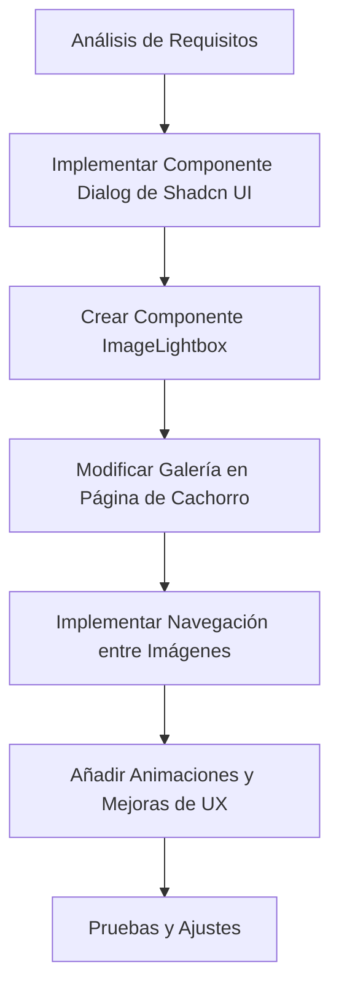

# Plan de Implementación de Lightbox para Galería de Imágenes

## Análisis de la Situación Actual

| Característica | Estado Actual | Estado Deseado |
|----------------|---------------|----------------|
| Galería de imágenes | Muestra miniaturas sin interactividad | Miniaturas clickables que abren un lightbox |
| Visualización a pantalla completa | No disponible | Disponible al hacer clic en una imagen |
| Navegación entre imágenes | No disponible | Botones para navegar entre imágenes |
| Cierre del lightbox | No aplicable | Botón de cierre y clic fuera del lightbox |
| Coherencia con UI | No aplicable | Integrado con el diseño de Shadcn UI |

Actualmente, en la página individual de cada cachorro (`src/app/(frontend)/puppies/[slug]/page.tsx`), se muestra una imagen principal y una galería de hasta 4 imágenes adicionales. Sin embargo, al hacer clic en estas imágenes no ocurre nada. El objetivo es implementar un lightbox que permita ver las imágenes a pantalla completa y navegar entre ellas.

## Plan de Mejora



### 1. Implementar Componente Dialog de Shadcn UI

**Objetivo:** Crear el componente base Dialog de Shadcn UI que servirá como fundamento para nuestro lightbox.

Shadcn UI utiliza componentes de Radix UI, por lo que necesitaremos instalar la dependencia correspondiente:

```bash
pnpm add @radix-ui/react-dialog
```

Luego, crearemos el componente Dialog en `src/components/ui/dialog.tsx`:

```tsx
'use client'

import * as React from 'react'
import * as DialogPrimitive from '@radix-ui/react-dialog'
import { X } from 'lucide-react'

import { cn } from '@/utilities/ui'

const Dialog = DialogPrimitive.Root

const DialogTrigger = DialogPrimitive.Trigger

const DialogPortal = DialogPrimitive.Portal

const DialogClose = DialogPrimitive.Close

const DialogOverlay = React.forwardRef<
  React.ElementRef<typeof DialogPrimitive.Overlay>,
  React.ComponentPropsWithoutRef<typeof DialogPrimitive.Overlay>
>(({ className, ...props }, ref) => (
  <DialogPrimitive.Overlay
    ref={ref}
    className={cn(
      'fixed inset-0 z-50 bg-black/80 backdrop-blur-sm data-[state=open]:animate-in data-[state=closed]:animate-out data-[state=closed]:fade-out-0 data-[state=open]:fade-in-0',
      className
    )}
    {...props}
  />
))
DialogOverlay.displayName = DialogPrimitive.Overlay.displayName

const DialogContent = React.forwardRef<
  React.ElementRef<typeof DialogPrimitive.Content>,
  React.ComponentPropsWithoutRef<typeof DialogPrimitive.Content>
>(({ className, children, ...props }, ref) => (
  <DialogPortal>
    <DialogOverlay />
    <DialogPrimitive.Content
      ref={ref}
      className={cn(
        'fixed left-[50%] top-[50%] z-50 grid w-full max-w-lg translate-x-[-50%] translate-y-[-50%] gap-4 border bg-background p-6 shadow-lg duration-200 data-[state=open]:animate-in data-[state=closed]:animate-out data-[state=closed]:fade-out-0 data-[state=open]:fade-in-0 data-[state=closed]:zoom-out-95 data-[state=open]:zoom-in-95 data-[state=closed]:slide-out-to-left-1/2 data-[state=closed]:slide-out-to-top-[48%] data-[state=open]:slide-in-from-left-1/2 data-[state=open]:slide-in-from-top-[48%] sm:rounded-lg',
        className
      )}
      {...props}
    >
      {children}
      <DialogPrimitive.Close className="absolute right-4 top-4 rounded-sm opacity-70 ring-offset-background transition-opacity hover:opacity-100 focus:outline-none focus:ring-2 focus:ring-ring focus:ring-offset-2 disabled:pointer-events-none data-[state=open]:bg-accent data-[state=open]:text-muted-foreground">
        <X className="h-4 w-4" />
        <span className="sr-only">Cerrar</span>
      </DialogPrimitive.Close>
    </DialogPrimitive.Content>
  </DialogPortal>
))
DialogContent.displayName = DialogPrimitive.Content.displayName

const DialogHeader = ({
  className,
  ...props
}: React.HTMLAttributes<HTMLDivElement>) => (
  <div
    className={cn(
      'flex flex-col space-y-1.5 text-center sm:text-left',
      className
    )}
    {...props}
  />
)
DialogHeader.displayName = 'DialogHeader'

const DialogFooter = ({
  className,
  ...props
}: React.HTMLAttributes<HTMLDivElement>) => (
  <div
    className={cn(
      'flex flex-col-reverse sm:flex-row sm:justify-end sm:space-x-2',
      className
    )}
    {...props}
  />
)
DialogFooter.displayName = 'DialogFooter'

const DialogTitle = React.forwardRef<
  React.ElementRef<typeof DialogPrimitive.Title>,
  React.ComponentPropsWithoutRef<typeof DialogPrimitive.Title>
>(({ className, ...props }, ref) => (
  <DialogPrimitive.Title
    ref={ref}
    className={cn(
      'text-lg font-semibold leading-none tracking-tight',
      className
    )}
    {...props}
  />
))
DialogTitle.displayName = DialogPrimitive.Title.displayName

const DialogDescription = React.forwardRef<
  React.ElementRef<typeof DialogPrimitive.Description>,
  React.ComponentPropsWithoutRef<typeof DialogPrimitive.Description>
>(({ className, ...props }, ref) => (
  <DialogPrimitive.Description
    ref={ref}
    className={cn('text-sm text-muted-foreground', className)}
    {...props}
  />
))
DialogDescription.displayName = DialogPrimitive.Description.displayName

export {
  Dialog,
  DialogPortal,
  DialogOverlay,
  DialogClose,
  DialogTrigger,
  DialogContent,
  DialogHeader,
  DialogFooter,
  DialogTitle,
  DialogDescription
}
```

### 2. Crear Componente ImageLightbox

**Objetivo:** Desarrollar un componente de lightbox especializado para imágenes que utilice el Dialog de Shadcn UI.

Crearemos el componente en `src/components/ImageLightbox/index.tsx`:

```tsx
'use client'

import React, { useState, useEffect } from 'react'
import Image from 'next/image'
import { ChevronLeft, ChevronRight, X } from 'lucide-react'
import {
  Dialog,
  DialogContent,
  DialogClose
} from '@/components/ui/dialog'
import { Button } from '@/components/ui/button'
import { Media } from '@/components/Media'
import { cn } from '@/utilities/ui'

type ImageType = {
  image: any
  alt?: string
}

interface ImageLightboxProps {
  images: ImageType[]
  initialIndex?: number
  open: boolean
  onOpenChange: (open: boolean) => void
}

export function ImageLightbox({
  images,
  initialIndex = 0,
  open,
  onOpenChange
}: ImageLightboxProps) {
  const [currentIndex, setCurrentIndex] = useState(initialIndex)

  // Reset index when dialog opens
  useEffect(() => {
    if (open) {
      setCurrentIndex(initialIndex)
    }
  }, [open, initialIndex])

  const handlePrevious = (e: React.MouseEvent) => {
    e.stopPropagation()
    setCurrentIndex((prev) => (prev === 0 ? images.length - 1 : prev - 1))
  }

  const handleNext = (e: React.MouseEvent) => {
    e.stopPropagation()
    setCurrentIndex((prev) => (prev === images.length - 1 ? 0 : prev + 1))
  }

  // Handle keyboard navigation
  useEffect(() => {
    const handleKeyDown = (e: KeyboardEvent) => {
      if (!open) return

      if (e.key === 'ArrowLeft') {
        setCurrentIndex((prev) => (prev === 0 ? images.length - 1 : prev - 1))
      } else if (e.key === 'ArrowRight') {
        setCurrentIndex((prev) => (prev === images.length - 1 ? 0 : prev + 1))
      } else if (e.key === 'Escape') {
        onOpenChange(false)
      }
    }

    window.addEventListener('keydown', handleKeyDown)
    return () => window.removeEventListener('keydown', handleKeyDown)
  }, [open, images.length, onOpenChange])

  if (!images || images.length === 0) return null

  const currentImage = images[currentIndex]

  return (
    <Dialog open={open} onOpenChange={onOpenChange}>
      <DialogContent className="max-w-screen-lg p-0 border-none bg-transparent">
        <div className="relative flex items-center justify-center w-full h-full">
          {/* Imagen actual */}
          <div className="relative w-full h-full max-h-[80vh] flex items-center justify-center">
            {currentImage.image ? (
              <div className="relative w-full h-full flex items-center justify-center">
                <Media
                  resource={currentImage.image}
                  className="object-contain max-h-[80vh] w-auto"
                  alt={currentImage.alt || 'Imagen de cachorro'}
                />
              </div>
            ) : (
              <Image
                src="/placeholder.svg?height=600&width=600"
                alt={currentImage.alt || 'Imagen de cachorro'}
                width={600}
                height={600}
                className="object-contain max-h-[80vh]"
              />
            )}
          </div>

          {/* Controles de navegación */}
          <div className="absolute inset-0 flex items-center justify-between p-4">
            <Button
              variant="outline"
              size="icon"
              className="rounded-full bg-background/80 backdrop-blur-sm hover:bg-background/90"
              onClick={handlePrevious}
              aria-label="Imagen anterior"
            >
              <ChevronLeft className="h-6 w-6" />
            </Button>
            <Button
              variant="outline"
              size="icon"
              className="rounded-full bg-background/80 backdrop-blur-sm hover:bg-background/90"
              onClick={handleNext}
              aria-label="Imagen siguiente"
            >
              <ChevronRight className="h-6 w-6" />
            </Button>
          </div>

          {/* Botón de cierre personalizado */}
          <DialogClose className="absolute right-4 top-4 rounded-full p-2 bg-background/80 backdrop-blur-sm hover:bg-background/90 opacity-70 ring-offset-background transition-opacity hover:opacity-100 focus:outline-none focus:ring-2 focus:ring-ring focus:ring-offset-2 disabled:pointer-events-none">
            <X className="h-4 w-4" />
            <span className="sr-only">Cerrar</span>
          </DialogClose>

          {/* Indicador de posición */}
          <div className="absolute bottom-4 left-0 right-0 flex justify-center gap-1.5">
            {images.map((_, index) => (
              <button
                key={index}
                className={cn(
                  "w-2 h-2 rounded-full transition-all",
                  index === currentIndex
                    ? "bg-white scale-125"
                    : "bg-white/50 hover:bg-white/80"
                )}
                onClick={(e) => {
                  e.stopPropagation()
                  setCurrentIndex(index)
                }}
                aria-label={`Ver imagen ${index + 1}`}
              />
            ))}
          </div>
        </div>
      </DialogContent>
    </Dialog>
  )
}
```

### 3. Modificar la Página de Cachorro

**Objetivo:** Integrar el componente ImageLightbox en la página individual de cada cachorro.

Para implementar el lightbox en la página de cachorro, necesitaremos convertir el componente de página a un componente cliente y añadir la funcionalidad de lightbox. Crearemos un componente cliente separado para la galería:

Primero, crearemos un nuevo componente en `src/components/PuppyGallery/index.tsx`:

```tsx
'use client'

import { useState } from 'react'
import Image from 'next/image'
import { Media } from '@/components/Media'
import { ImageLightbox } from '@/components/ImageLightbox'

interface PuppyGalleryProps {
  mainImage: any
  gallery: any[]
  puppyName?: string
}

export function PuppyGallery({ mainImage, gallery = [], puppyName = 'Cachorro' }: PuppyGalleryProps) {
  const [lightboxOpen, setLightboxOpen] = useState(false)
  const [initialImageIndex, setInitialImageIndex] = useState(0)

  // Preparar las imágenes para el lightbox (incluir la imagen principal y la galería)
  const allImages = [
    { image: mainImage, alt: `Imagen principal de ${puppyName}` },
    ...(gallery?.map((item: any) => ({
      image: item.image,
      alt: `Imagen de ${puppyName}`
    })) || [])
  ]

  return (
    <div className="w-full">
      {/* Imagen Principal */}
      <div
        className="relative aspect-square mb-4 bg-muted rounded-lg overflow-hidden cursor-pointer hover:opacity-90 transition-opacity"
        onClick={() => {
          setInitialImageIndex(0)
          setLightboxOpen(true)
        }}
      >
        {mainImage ? (
          <Media
            resource={mainImage}
            fill
            size="square"
            className="object-contain"
            priority
          />
        ) : (
          <Image
            src="/placeholder.svg?height=600&width=600"
            alt={puppyName}
            fill
            className="object-cover"
            priority
          />
        )}
      </div>

      {/* Galería de Miniaturas */}
      <div className="grid grid-cols-4 gap-2">
        {gallery && gallery.length > 0
          ? gallery.slice(0, 4).map((item: any, index: number) => (
              <div
                key={index}
                className="relative aspect-square bg-muted rounded-lg overflow-hidden cursor-pointer hover:opacity-80 transition-opacity"
                onClick={() => {
                  setInitialImageIndex(index + 1) // +1 porque la imagen principal es la primera
                  setLightboxOpen(true)
                }}
              >
                <Media resource={item.image} fill className="object-cover" />
              </div>
            ))
          : Array.from({ length: 4 }).map((_, i) => (
              <div
                key={i}
                className="relative aspect-square bg-muted rounded-lg overflow-hidden"
              >
                <Image
                  src={`/placeholder.svg?height=150&width=150`}
                  alt={`Imagen ${i + 1} del cachorro`}
                  fill
                  className="object-cover"
                />
              </div>
            ))}
      </div>

      {/* Lightbox */}
      <ImageLightbox
        images={allImages}
        initialIndex={initialImageIndex}
        open={lightboxOpen}
        onOpenChange={setLightboxOpen}
      />
    </div>
  )
}
```

Luego, modificaremos la página de cachorro para utilizar este nuevo componente:

```tsx
// En src/app/(frontend)/puppies/[slug]/page.tsx
// Reemplazar la sección de imágenes con el nuevo componente

// Importar el componente
import { PuppyGallery } from '@/components/PuppyGallery'

// Reemplazar la sección de imágenes
<div className="w-full lg:w-3/5">
  <PuppyGallery
    mainImage={mainImage}
    gallery={gallery || []}
    puppyName={name || 'Cachorro'}
  />
</div>
```

### 4. Implementar Navegación entre Imágenes

**Objetivo:** Asegurar que la navegación entre imágenes sea intuitiva y accesible.

La navegación ya está implementada en el componente ImageLightbox con:
- Botones de navegación izquierda/derecha
- Navegación con teclado (flechas izquierda/derecha)
- Indicadores de posición en la parte inferior
- Cierre con tecla Escape o botón X

### 5. Añadir Animaciones y Mejoras de UX

**Objetivo:** Mejorar la experiencia de usuario con animaciones fluidas y feedback visual.

Las animaciones ya están incluidas en el componente Dialog de Shadcn UI, que proporciona:
- Animaciones de entrada/salida
- Transiciones suaves
- Backdrop con desenfoque

## Consideraciones Adicionales

1. **Rendimiento**: Las imágenes grandes pueden afectar el rendimiento. Considerar la carga diferida y optimización de imágenes.

2. **Accesibilidad**: El componente incluye:
   - Navegación por teclado
   - Etiquetas aria para lectores de pantalla
   - Elementos focusables en orden lógico

3. **Dispositivos móviles**: El lightbox es completamente responsivo y funciona bien en dispositivos táctiles.

4. **Compatibilidad con navegadores**: Las animaciones utilizan propiedades CSS modernas que funcionan en navegadores actuales.

5. **Internacionalización**: Los textos están en español pero pueden adaptarse fácilmente para soportar múltiples idiomas.

## Implementación Paso a Paso

### Paso 1: Instalar Dependencias

Instalar la dependencia de Radix UI para el componente Dialog:

```bash
pnpm add @radix-ui/react-dialog
```

### Paso 2: Crear Componentes

1. Crear el componente Dialog de Shadcn UI
2. Crear el componente ImageLightbox
3. Crear el componente PuppyGallery

### Paso 3: Modificar la Página de Cachorro

1. Importar el componente PuppyGallery
2. Reemplazar la sección de imágenes con el nuevo componente

### Paso 4: Pruebas y Ajustes

1. Probar la funcionalidad en diferentes dispositivos y navegadores
2. Ajustar estilos y animaciones según sea necesario
3. Verificar la accesibilidad

## Próximos Pasos

1. **Optimización de imágenes**: Implementar carga progresiva y formatos modernos como WebP.
2. **Gestos táctiles**: Añadir soporte para deslizar en dispositivos táctiles.
3. **Zoom**: Añadir funcionalidad de zoom para examinar detalles de las imágenes.
4. **Compartir**: Añadir opciones para compartir imágenes en redes sociales.
