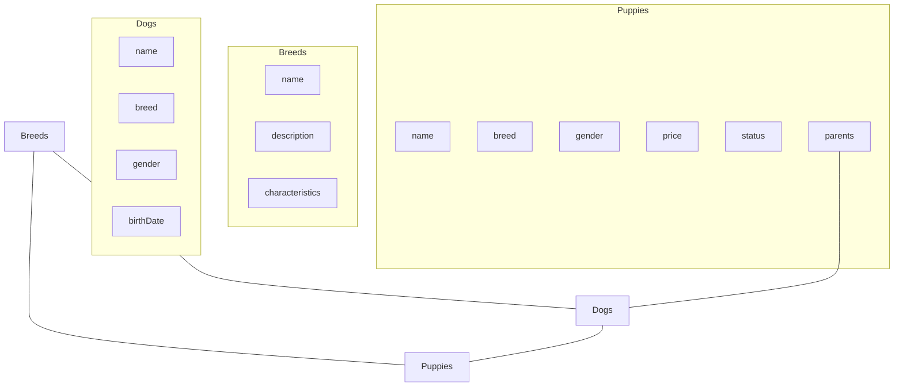
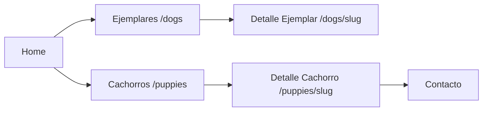

# Plan de Implementación para la Colección de Puppies

## Objetivo
Crear una nueva colección llamada "Puppies" para mostrar los cachorros en venta, con información específica como precio, disponibilidad y relaciones con los padres de la colección Dogs.

## 1. Estructura de la Colección Puppies

Crearemos una nueva colección con la siguiente estructura:

```typescript
// src/collections/Puppies.ts
import type { CollectionConfig } from 'payload'
import { slugField } from '@/fields/slug'
import { authenticatedOrPublished } from '../access/authenticatedOrPublished'
import { isAdminOrEditor } from '../access/isAdminOrEditor'
import { collectionAccess } from '../access/hideFromEditor'

export const Puppies: CollectionConfig = {
  slug: 'puppies',
  access: {
    create: isAdminOrEditor,
    delete: isAdminOrEditor,
    read: authenticatedOrPublished,
    update: isAdminOrEditor,
  },
  admin: {
    useAsTitle: 'name',
    defaultColumns: ['name', 'breed', 'gender', 'price', 'status', 'updatedAt'],
    hidden: ({ user }) => !collectionAccess('puppies')({ user }),
  },
  fields: [
    {
      name: 'name',
      type: 'text',
      required: true,
      label: 'Nombre del Cachorro',
    },
    {
      name: 'breed',
      type: 'relationship',
      relationTo: 'breeds',
      required: true,
      label: 'Raza',
    },
    {
      name: 'gender',
      type: 'select',
      required: true,
      options: [
        {
          label: 'Macho',
          value: 'male',
        },
        {
          label: 'Hembra',
          value: 'female',
        },
      ],
      label: 'Género',
    },
    {
      name: 'price',
      type: 'number',
      required: true,
      label: 'Precio (€)',
    },
    {
      name: 'status',
      type: 'select',
      required: true,
      options: [
        {
          label: 'Disponible',
          value: 'available',
        },
        {
          label: 'Reservado',
          value: 'reserved',
        },
        {
          label: 'Vendido',
          value: 'sold',
        },
      ],
      defaultValue: 'available',
      label: 'Estado',
    },
    {
      name: 'parents',
      type: 'group',
      label: 'Padres',
      fields: [
        {
          name: 'father',
          type: 'relationship',
          relationTo: 'dogs',
          label: 'Padre',
          filterOptions: {
            gender: {
              equals: 'male',
            },
          },
        },
        {
          name: 'mother',
          type: 'relationship',
          relationTo: 'dogs',
          label: 'Madre',
          filterOptions: {
            gender: {
              equals: 'female',
            },
          },
        },
      ],
    },
    {
      type: 'tabs',
      tabs: [
        {
          label: 'Información Básica',
          fields: [
            {
              name: 'birthDate',
              type: 'date',
              required: true,
              label: 'Fecha de Nacimiento',
            },
            {
              name: 'description',
              type: 'richText',
              required: true,
              label: 'Descripción',
            },
            {
              name: 'mainImage',
              type: 'upload',
              relationTo: 'media',
              required: true,
              label: 'Imagen Principal',
            },
            {
              name: 'gallery',
              type: 'array',
              label: 'Galería de Imágenes',
              fields: [
                {
                  name: 'image',
                  type: 'upload',
                  relationTo: 'media',
                  required: true,
                },
                {
                  name: 'caption',
                  type: 'text',
                },
              ],
            },
          ],
        },
        {
          label: 'Características',
          fields: [
            {
              name: 'color',
              type: 'text',
              required: true,
              label: 'Color',
            },
            {
              name: 'weight',
              type: 'number',
              required: true,
              label: 'Peso (kg)',
            },
            {
              name: 'specialFeatures',
              type: 'array',
              label: 'Características Especiales',
              fields: [
                {
                  name: 'feature',
                  type: 'text',
                  required: true,
                },
                {
                  name: 'description',
                  type: 'textarea',
                },
              ],
            },
          ],
        },
      ],
    },
    {
      name: 'publishedAt',
      type: 'date',
      admin: {
        position: 'sidebar',
      },
    },
    ...slugField('name'),
  ],
  hooks: {
    beforeChange: [
      ({ data }) => {
        if (data._status === 'published' && !data.publishedAt) {
          return {
            ...data,
            publishedAt: new Date(),
          }
        }
        return data
      },
    ],
  },
  versions: {
    drafts: {
      autosave: true,
    },
  },
}
```

## 2. Componentes para Visualizar los Puppies

### PuppyCard.tsx

```typescript
// src/components/Card/PuppyCard.tsx
'use client'
import { cn } from '@/utilities/ui'
import useClickableCard from '@/utilities/useClickableCard'
import Link from 'next/link'
import React from 'react'

import { Media } from '@/components/Media'

export type CardPuppyData = {
  id?: string | number | null
  slug?: string | null
  name?: string | null
  breed?: any
  gender?: 'male' | 'female' | null
  mainImage?: any
  price?: number | null
  status?: 'available' | 'reserved' | 'sold' | null
}

export const PuppyCard: React.FC<{
  className?: string
  doc?: CardPuppyData
  relationTo?: 'puppies'
  showBreed?: boolean
}> = (props) => {
  const { card, link } = useClickableCard({})
  const { className, doc, relationTo, showBreed } = props

  // Extraemos los datos con valores por defecto para evitar problemas
  const slug = doc?.slug || ''
  const name = doc?.name || 'Sin nombre'
  const gender = doc?.gender
  const mainImage = doc?.mainImage
  const price = doc?.price || 0
  const status = doc?.status || 'available'

  // Aseguramos que siempre tengamos un nombre de raza
  const breedName =
    doc?.breed && typeof doc.breed === 'object' ? doc.breed?.name : 'Raza no especificada'
  const genderText = gender === 'male' ? 'Macho' : gender === 'female' ? 'Hembra' : ''
  const href = `/${relationTo}/${slug}`

  // Texto y color según el estado
  const statusText =
    status === 'available' ? 'Disponible' :
    status === 'reserved' ? 'Reservado' :
    status === 'sold' ? 'Vendido' : ''

  const statusColor =
    status === 'available' ? 'bg-green-500' :
    status === 'reserved' ? 'bg-yellow-500' :
    status === 'sold' ? 'bg-red-500' : ''

  return (
    <article
      className={cn(
        'border border-border rounded-lg overflow-hidden bg-card hover:cursor-pointer',
        className,
      )}
      ref={card.ref}
    >
      <div className="relative w-full">
        {!mainImage && (
          <div className="h-48 bg-gray-100 dark:bg-gray-800 flex items-center justify-center">
            No image
          </div>
        )}
        {mainImage && typeof mainImage !== 'string' && (
          <div className="relative w-full overflow-hidden">
            <Media resource={mainImage} size="" className="h-48 w-full object-cover" />
            <div className="absolute top-2 right-2 flex flex-col gap-2">
              {genderText && (
                <span
                  className={`px-2 py-1 rounded-full text-xs font-semibold ${
                    gender === 'male' ? 'bg-blue-500 text-white' : 'bg-pink-500 text-white'
                  }`}
                >
                  {genderText}
                </span>
              )}
              {statusText && (
                <span className={`px-2 py-1 rounded-full text-xs font-semibold text-white ${statusColor}`}>
                  {statusText}
                </span>
              )}
            </div>
          </div>
        )}
      </div>
      <div className="p-4">
        {showBreed && breedName && <div className="uppercase text-sm mb-2">{breedName}</div>}
        {name && (
          <div className="prose mb-2">
            <h3 className="mb-1">
              <Link className="not-prose" href={href} ref={link.ref}>
                {name}
              </Link>
            </h3>
          </div>
        )}
        <div className="text-lg font-bold text-primary">{price.toLocaleString('es-ES')} €</div>
      </div>
    </article>
  )
}
```

### PuppiesArchive.tsx

```typescript
// src/components/PuppiesArchive/index.tsx
import { cn } from '@/utilities/ui'
import React from 'react'

import { PuppyCard, CardPuppyData } from '@/components/Card/PuppyCard'

export type Props = {
  puppies: CardPuppyData[]
}

export const PuppiesArchive: React.FC<Props> = (props) => {
  const { puppies } = props

  return (
    <div className={cn('container')}>
      <div>
        <div className="grid grid-cols-4 sm:grid-cols-8 lg:grid-cols-12 gap-y-4 gap-x-4 lg:gap-y-8 lg:gap-x-8 xl:gap-x-8">
          {puppies?.map((result, index) => {
            if (typeof result === 'object' && result !== null) {
              return (
                <div className="col-span-4" key={index}>
                  <PuppyCard className="h-full" doc={result} relationTo="puppies" showBreed />
                </div>
              )
            }

            return null
          })}
        </div>
      </div>
    </div>
  )
}
```

## 3. Página para Visualizar los Puppies

```typescript
// src/app/(frontend)/puppies/page.tsx
import type { Metadata } from 'next/types'

import { PuppiesArchive } from '@/components/PuppiesArchive'
import { PageRange } from '@/components/PageRange'
import { Pagination } from '@/components/Pagination'
import configPromise from '@payload-config'
import { getPayload } from 'payload'
import React from 'react'

export const dynamic = 'force-static'
export const revalidate = 600

export default async function Page() {
  const payload = await getPayload({ config: configPromise })

  // Obtener Puppies
  const puppies = await payload.find({
    collection: 'puppies',
    depth: 2,
    limit: 12,
    overrideAccess: false,
    where: {
      status: {
        not_equals: 'sold',
      },
    },
    select: {
      id: true,
      name: true,
      slug: true,
      breed: true,
      gender: true,
      mainImage: true,
      price: true,
      status: true,
    },
  })

  return (
    <div className="pt-24 pb-24">
      <div className="container mb-16">
        <div className="prose dark:prose-invert max-w-none">
          <h1>Cachorros en Venta</h1>
          <p>Descubre nuestros cachorros disponibles para formar parte de tu familia.</p>
        </div>
      </div>

      <div className="container mb-8">
        <PageRange
          collection="puppies"
          currentPage={puppies.page}
          limit={12}
          totalDocs={puppies.totalDocs}
        />
      </div>

      <PuppiesArchive puppies={puppies.docs} />

      <div className="container">
        {puppies.totalPages > 1 && puppies.page && (
          <Pagination page={puppies.page} totalPages={puppies.totalPages} />
        )}
      </div>
    </div>
  )
}

export function generateMetadata(): Metadata {
  return {
    title: `Criadero Goizametz - Cachorros en Venta`,
  }
}
```

## 4. Página de Detalle para un Cachorro Individual

```typescript
// src/app/(frontend)/puppies/[slug]/page.tsx
import type { Metadata } from 'next/types'
import { notFound } from 'next/navigation'

import { Media } from '@/components/Media'
import { RichText } from '@/components/RichText'
import configPromise from '@payload-config'
import { getPayload } from 'payload'
import React from 'react'

export const dynamic = 'force-static'
export const revalidate = 600

export default async function Page({ params: { slug } }) {
  const payload = await getPayload({ config: configPromise })

  const puppyQuery = await payload.find({
    collection: 'puppies',
    depth: 2,
    where: {
      slug: {
        equals: slug,
      },
    },
  })

  const puppy = puppyQuery.docs[0]

  if (!puppy) {
    return notFound()
  }

  const {
    name,
    breed,
    gender,
    price,
    status,
    parents,
    birthDate,
    description,
    mainImage,
    gallery,
    color,
    weight
  } = puppy

  const statusText =
    status === 'available' ? 'Disponible' :
    status === 'reserved' ? 'Reservado' :
    status === 'sold' ? 'Vendido' : ''

  const statusColor =
    status === 'available' ? 'text-green-500' :
    status === 'reserved' ? 'text-yellow-500' :
    status === 'sold' ? 'text-red-500' : ''

  const formattedBirthDate = new Date(birthDate).toLocaleDateString('es-ES', {
    day: 'numeric',
    month: 'long',
    year: 'numeric',
  })

  return (
    <div className="pt-24 pb-24">
      <div className="container">
        <div className="grid grid-cols-1 md:grid-cols-2 gap-8">
          <div>
            {mainImage && (
              <Media
                resource={mainImage}
                className="w-full h-auto rounded-lg mb-4"
              />
            )}
            {gallery && gallery.length > 0 && (
              <div className="grid grid-cols-3 gap-2">
                {gallery.map((item, index) => (
                  <Media
                    key={index}
                    resource={item.image}
                    className="w-full h-32 object-cover rounded-lg"
                  />
                ))}
              </div>
            )}
          </div>
          <div>
            <div className="prose dark:prose-invert max-w-none mb-6">
              <h1>{name}</h1>
              <div className="flex items-center gap-4 mb-4">
                <span className="text-lg font-bold">{breed?.name}</span>
                <span className={`px-3 py-1 rounded-full text-sm font-semibold ${
                  gender === 'male' ? 'bg-blue-500 text-white' : 'bg-pink-500 text-white'
                }`}>
                  {gender === 'male' ? 'Macho' : 'Hembra'}
                </span>
                <span className={`font-semibold ${statusColor}`}>
                  {statusText}
                </span>
              </div>
              <div className="text-2xl font-bold text-primary mb-6">
                {price.toLocaleString('es-ES')} €
              </div>

              <div className="mb-6">
                <h3>Detalles</h3>
                <ul>
                  <li><strong>Fecha de nacimiento:</strong> {formattedBirthDate}</li>
                  <li><strong>Color:</strong> {color}</li>
                  <li><strong>Peso:</strong> {weight} kg</li>
                  {parents?.father && <li><strong>Padre:</strong> {parents.father.name}</li>}
                  {parents?.mother && <li><strong>Madre:</strong> {parents.mother.name}</li>}
                </ul>
              </div>

              <div>
                <h3>Descripción</h3>
                <RichText content={description} />
              </div>

              {status === 'available' && (
                <div className="mt-8">
                  <a
                    href="/contacto"
                    className="bg-primary text-white px-6 py-3 rounded-lg font-semibold hover:bg-primary-dark transition-colors"
                  >
                    Contactar para más información
                  </a>
                </div>
              )}
            </div>
          </div>
        </div>
      </div>
    </div>
  )
}

export async function generateMetadata({ params: { slug } }): Promise<Metadata> {
  const payload = await getPayload({ config: configPromise })

  const puppyQuery = await payload.find({
    collection: 'puppies',
    depth: 1,
    where: {
      slug: {
        equals: slug,
      },
    },
  })

  const puppy = puppyQuery.docs[0]

  if (!puppy) {
    return {
      title: 'Cachorro no encontrado',
    }
  }

  return {
    title: `${puppy.name} - Cachorro en venta - Criadero Goizametz`,
    description: `${puppy.breed?.name} - ${puppy.gender === 'male' ? 'Macho' : 'Hembra'} - ${puppy.status === 'available' ? 'Disponible' : puppy.status === 'reserved' ? 'Reservado' : 'Vendido'}`,
  }
}
```

## 5. Actualización del archivo de configuración de Payload

Necesitamos actualizar el archivo `payload.config.ts` para incluir la nueva colección:

```typescript
// Modificación en src/payload.config.ts
import { Puppies } from './collections/Puppies'

// ...

collections: [Pages, Posts, Breeds, Dogs, Puppies, Media, Categories, Users],
```

## Diagrama de Relaciones entre Colecciones



## Flujo de Navegación



## Pasos de Implementación

1. Crear el archivo `src/collections/Puppies.ts` con la estructura definida
2. Crear el componente `src/components/Card/PuppyCard.tsx`
3. Crear el componente `src/components/PuppiesArchive/index.tsx`
4. Crear la página `src/app/(frontend)/puppies/page.tsx`
5. Crear la página de detalle `src/app/(frontend)/puppies/[slug]/page.tsx`
6. Actualizar el archivo `src/payload.config.ts` para incluir la nueva colección
7. Reiniciar el servidor para que los cambios surtan efecto
8. Probar la creación de cachorros desde el panel de administración
9. Verificar la visualización de cachorros en la interfaz
