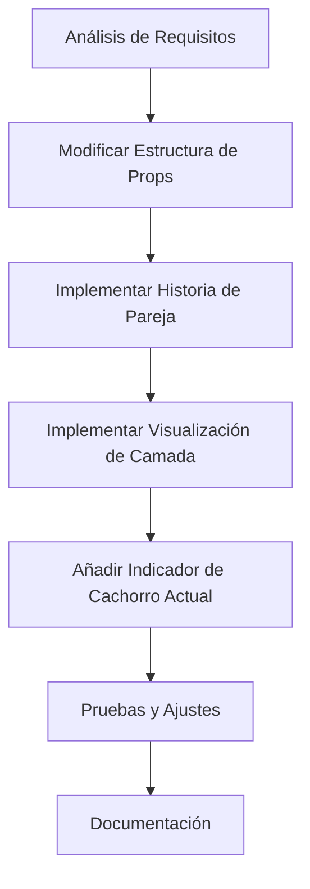
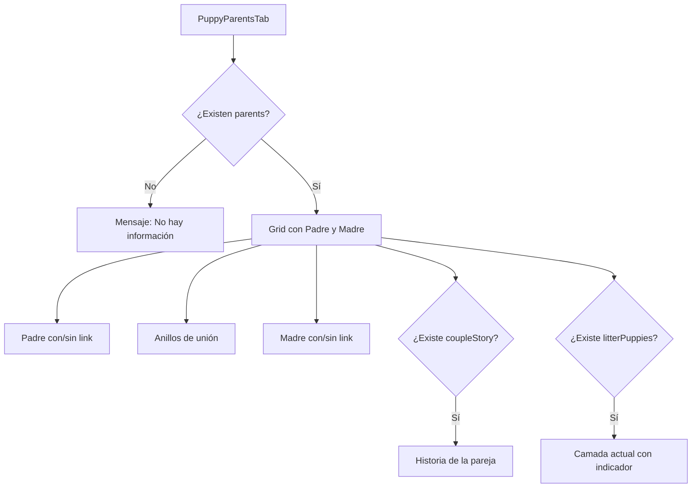

# Plan de Mejora del Componente PuppyParentsTab

## Análisis Comparativo entre v0 y Versión Actual

| Característica | Versión v0 | Versión Actual |
|----------------|------------|----------------|
| Estructura | Integrada en página principal | Componente separado |
| Datos | Estáticos/hardcodeados | Dinámicos vía props |
| Enlaces | No tiene | Links a páginas de padres |
| Historia de pareja | ✅ Incluida | ❌ No incluida |
| Camada actual | ✅ Incluida | ❌ No incluida |
| Manejo de errores | ❌ Limitado | ✅ Robusto |
| Diseño adaptativo | ✅ Básico | ✅ Mejorado |

## Plan de Mejora



### 1. Modificar Estructura de Props

**Objetivo:** Ampliar las props del componente para soportar las nuevas características.

```typescript
type ParentsTabProps = {
  parents: any;
  puppyName: string;
  // Nuevas props
  coupleStory?: string | any; // Historia de la pareja (puede ser texto plano o rich text)
  litterPuppies?: Array<{
    id: string | number;
    image: any;
    isCurrentPuppy?: boolean;
  }>;
  currentPuppyId?: string | number; // ID del cachorro actual para resaltarlo
}
```

### 2. Implementar Historia de la Pareja

**Objetivo:** Añadir la sección de "Historia de la pareja" con el diseño de fondo ámbar.

```jsx
{/* Historia de la pareja */}
{coupleStory && (
  <div className="bg-amber-50 rounded-lg p-4 text-center mt-6">
    <h3 className="font-medium mb-2">Historia de la pareja</h3>
    {typeof coupleStory === 'string' ? (
      <p className="text-sm">{coupleStory}</p>
    ) : (
      <div className="text-sm">
        <RichText data={coupleStory} enableGutter={false} />
      </div>
    )}
  </div>
)}
```

### 3. Implementar Visualización de Camada

**Objetivo:** Añadir la sección de "Camada actual" con miniaturas de todos los cachorros.

```jsx
{/* Camada resultante */}
{litterPuppies && litterPuppies.length > 0 && (
  <div className="mt-6">
    <h3 className="font-medium mb-3 text-center">Camada actual</h3>
    <div className="grid grid-cols-3 sm:grid-cols-6 gap-2">
      {litterPuppies.map((puppy) => (
        <div
          key={puppy.id}
          className="relative aspect-square bg-muted rounded-lg overflow-hidden border"
        >
          {puppy.image && typeof puppy.image === 'object' ? (
            <Media
              resource={puppy.image}
              fill
              className="object-cover"
              alt={`Cachorro de la camada`}
            />
          ) : (
            <Image
              src={`/placeholder.svg?height=100&width=100`}
              alt={`Cachorro de la camada`}
              fill
              className="object-cover"
            />
          )}
          {(puppy.isCurrentPuppy || puppy.id === currentPuppyId) && (
            <div className="absolute bottom-0 left-0 right-0 bg-amber-100 text-amber-800 text-xs text-center py-1">
              Este cachorro
            </div>
          )}
        </div>
      ))}
    </div>
  </div>
)}
```

### 4. Elemento de Unión para Móviles

**Objetivo:** Asegurar que el elemento de unión (anillos) se muestre correctamente en dispositivos móviles.

```jsx
{/* Elemento de unión para móviles */}
<div className="md:hidden flex justify-center items-center py-4">
  <div className="bg-white rounded-full p-2 shadow-sm border">
    <div className="relative w-12 h-12 flex items-center justify-center">
      <svg
        width="48"
        height="48"
        viewBox="0 0 24 24"
        fill="none"
        xmlns="http://www.w3.org/2000/svg"
        className="text-amber-400"
      >
        <circle cx="8" cy="12" r="5" stroke="currentColor" strokeWidth="2" fill="none" />
      </svg>
      <svg
        width="48"
        height="48"
        viewBox="0 0 24 24"
        fill="none"
        xmlns="http://www.w3.org/2000/svg"
        className="text-amber-400 absolute left-1/2 transform -translate-x-1/2"
      >
        <circle cx="16" cy="12" r="5" stroke="currentColor" strokeWidth="2" fill="none" />
      </svg>
    </div>
  </div>
</div>
```

### 5. Estructura Final del Componente

El componente mejorado tendría esta estructura:



## Implementación Paso a Paso

### Paso 1: Actualizar la Interfaz de Props

Modificar la definición de tipos para incluir las nuevas propiedades.

### Paso 2: Actualizar el Componente Principal

Modificar el componente `PuppyParentsTab` para incluir las nuevas secciones, manteniendo la lógica condicional existente.

### Paso 3: Actualizar la Página Principal

Modificar la página principal (`puppies/[slug]/page.tsx`) para pasar las nuevas props al componente.

### Paso 4: Implementar la Obtención de Datos

Asegurar que la consulta a la base de datos incluya la información necesaria para las nuevas características (historia de la pareja, camada).

### Paso 5: Pruebas y Ajustes

Probar el componente con diferentes combinaciones de datos para asegurar que se comporta correctamente en todos los escenarios.

## Consideraciones Adicionales

1. **Rendimiento**: Las nuevas características añaden más elementos al DOM, lo que podría afectar el rendimiento. Considerar la carga diferida de imágenes.

2. **Accesibilidad**: Asegurar que todas las imágenes tengan textos alternativos adecuados y que la navegación sea posible mediante teclado.

3. **Internacionalización**: Preparar los textos para soportar múltiples idiomas si es necesario.

4. **Mantenimiento**: Documentar adecuadamente las nuevas props y su uso esperado.

## Código Propuesto (Versión Completa)

A continuación se muestra cómo quedaría el componente completo con todas las mejoras implementadas:

```tsx
import Image from 'next/image'
import Link from 'next/link'
import { Media } from '@/components/Media'
import RichText from '@/components/RichText'

// Función para extraer texto seguro de posibles objetos complejos
const getSafeText = (value: any, defaultText: string): string => {
  if (typeof value === 'string') return value
  if (value && typeof value === 'object' && 'root' in value) {
    // Si es un objeto con estructura de rich text, devolver texto por defecto
    return defaultText
  }
  return defaultText
}

type ParentsTabProps = {
  parents: any
  puppyName: string
  coupleStory?: string | any
  litterPuppies?: Array<{
    id: string | number
    image: any
    isCurrentPuppy?: boolean
  }>
  currentPuppyId?: string | number
}

export const PuppyParentsTab = ({
  parents,
  puppyName,
  coupleStory,
  litterPuppies,
  currentPuppyId
}: ParentsTabProps) => {
  if (!parents) {
    return (
      <div className="text-center py-4">
        <p>No hay información disponible sobre los padres de este cachorro.</p>
      </div>
    )
  }

  return (
    <div className="space-y-6">
      <h3 className="text-lg font-semibold text-center">
        Conoce a los padres de {getSafeText(puppyName, 'este cachorro')}
      </h3>

      <div className="grid grid-cols-1 md:grid-cols-2 gap-6 relative">
        {/* Padre */}
        {parents.father && parents.father.slug ? (
          <Link
            href={`/dogs/${parents.father.slug}`}
            className="block transition-transform hover:scale-[1.02]"
          >
            <div className="border rounded-lg p-4 shadow-sm hover:shadow-md transition-shadow">
              <h3 className="font-medium mb-3 text-center">Padre</h3>
              <div className="relative aspect-video bg-muted rounded-lg overflow-hidden mb-3">
                {parents.father.mainImage && typeof parents.father.mainImage === 'object' ? (
                  <Media
                    resource={parents.father.mainImage}
                    size="thumbnail"
                    className="h-full w-full object-cover"
                    alt={`Padre de ${getSafeText(puppyName, 'cachorro')}`}
                  />
                ) : (
                  <Image
                    src="/placeholder.svg?height=200&width=300"
                    alt="Padre del cachorro"
                    fill
                    className="object-cover"
                  />
                )}
              </div>
              <div className="bg-slate-50 p-3 rounded">
                <h4 className="font-medium text-sm mb-1">Información</h4>
                <p className="text-sm">
                  <strong>Nombre:</strong> {getSafeText(parents?.father?.name, 'No disponible')}
                </p>
                <p className="text-sm mt-1">
                  <strong>Descripción:</strong>{' '}
                  {getSafeText(parents?.father?.description, 'Información no disponible')}
                </p>
              </div>
            </div>
          </Link>
        ) : (
          <div className="border rounded-lg p-4 shadow-sm">
            <h3 className="font-medium mb-3 text-center">Padre</h3>
            <div className="relative aspect-video bg-muted rounded-lg overflow-hidden mb-3">
              <Image
                src="/placeholder.svg?height=200&width=300"
                alt="Padre del cachorro"
                fill
                className="object-cover"
              />
            </div>
            <div className="bg-slate-50 p-3 rounded">
              <h4 className="font-medium text-sm mb-1">Información</h4>
              <p className="text-sm">
                <strong>Nombre:</strong> No disponible
              </p>
              <p className="text-sm mt-1">
                <strong>Descripción:</strong> Información no disponible
              </p>
            </div>
          </div>
        )}

        {/* Elemento central - Anillos de unión */}
        <div className="absolute left-1/2 top-1/2 transform -translate-x-1/2 -translate-y-1/2 z-10 hidden md:block">
          <div className="bg-white rounded-full p-3 shadow-md border">
            <div className="relative w-16 h-16 flex items-center justify-center">
              <svg
                width="64"
                height="64"
                viewBox="0 0 24 24"
                fill="none"
                xmlns="http://www.w3.org/2000/svg"
                className="text-amber-400"
              >
                <circle cx="8" cy="12" r="5" stroke="currentColor" strokeWidth="2" fill="none" />
              </svg>
              <svg
                width="64"
                height="64"
                viewBox="0 0 24 24"
                fill="none"
                xmlns="http://www.w3.org/2000/svg"
                className="text-amber-400 absolute left-1/2 transform -translate-x-1/2"
              >
                <circle cx="16" cy="12" r="5" stroke="currentColor" strokeWidth="2" fill="none" />
              </svg>
            </div>
          </div>
        </div>

        {/* Madre */}
        {parents.mother && parents.mother.slug ? (
          <Link
            href={`/dogs/${parents.mother.slug}`}
            className="block transition-transform hover:scale-[1.02]"
          >
            <div className="border rounded-lg p-4 shadow-sm hover:shadow-md transition-shadow">
              <h3 className="font-medium mb-3 text-center">Madre</h3>
              <div className="relative aspect-video bg-muted rounded-lg overflow-hidden mb-3">
                {parents.mother.mainImage && typeof parents.mother.mainImage === 'object' ? (
                  <Media
                    resource={parents.mother.mainImage}
                    fill
                    className="object-cover"
                    alt={`Madre de ${getSafeText(puppyName, 'cachorro')}`}
                  />
                ) : (
                  <Image
                    src="/placeholder.svg?height=200&width=300"
                    alt="Madre del cachorro"
                    fill
                    className="object-cover"
                  />
                )}
              </div>
              <div className="bg-slate-50 p-3 rounded">
                <h4 className="font-medium text-sm mb-1">Información</h4>
                <p className="text-sm">
                  <strong>Nombre:</strong> {getSafeText(parents?.mother?.name, 'No disponible')}
                </p>
                <p className="text-sm mt-1">
                  <strong>Descripción:</strong>{' '}
                  {getSafeText(parents?.mother?.description, 'Información no disponible')}
                </p>
              </div>
            </div>
          </Link>
        ) : (
          <div className="border rounded-lg p-4 shadow-sm">
            <h3 className="font-medium mb-3 text-center">Madre</h3>
            <div className="relative aspect-video bg-muted rounded-lg overflow-hidden mb-3">
              <Image
                src="/placeholder.svg?height=200&width=300"
                alt="Madre del cachorro"
                fill
                className="object-cover"
              />
            </div>
            <div className="bg-slate-50 p-3 rounded">
              <h4 className="font-medium text-sm mb-1">Información</h4>
              <p className="text-sm">
                <strong>Nombre:</strong> No disponible
              </p>
              <p className="text-sm mt-1">
                <strong>Descripción:</strong> Información no disponible
              </p>
            </div>
          </div>
        )}
      </div>

      {/* Elemento de unión para móviles */}
      <div className="md:hidden flex justify-center items-center py-2">
        <div className="bg-white rounded-full p-2 shadow-sm border">
          <div className="relative w-12 h-12 flex items-center justify-center">
            <svg
              width="48"
              height="48"
              viewBox="0 0 24 24"
              fill="none"
              xmlns="http://www.w3.org/2000/svg"
              className="text-amber-400"
            >
              <circle cx="8" cy="12" r="5" stroke="currentColor" strokeWidth="2" fill="none" />
            </svg>
            <svg
              width="48"
              height="48"
              viewBox="0 0 24 24"
              fill="none"
              xmlns="http://www.w3.org/2000/svg"
              className="text-amber-400 absolute left-1/2 transform -translate-x-1/2"
            >
              <circle cx="16" cy="12" r="5" stroke="currentColor" strokeWidth="2" fill="none" />
            </svg>
          </div>
        </div>
      </div>

      {/* Historia de la pareja */}
      {coupleStory && (
        <div className="bg-amber-50 rounded-lg p-4 text-center mt-4">
          <h3 className="font-medium mb-2">Historia de la pareja</h3>
          {typeof coupleStory === 'string' ? (
            <p className="text-sm">{coupleStory}</p>
          ) : (
            <div className="text-sm">
              <RichText data={coupleStory} enableGutter={false} />
            </div>
          )}
        </div>
      )}

      {/* Camada resultante */}
      {litterPuppies && litterPuppies.length > 0 && (
        <div className="mt-4">
          <h3 className="font-medium mb-3 text-center">Camada actual</h3>
          <div className="grid grid-cols-3 sm:grid-cols-6 gap-2">
            {litterPuppies.map((puppy) => (
              <div
                key={puppy.id}
                className="relative aspect-square bg-muted rounded-lg overflow-hidden border"
              >
                {puppy.image && typeof puppy.image === 'object' ? (
                  <Media
                    resource={puppy.image}
                    fill
                    className="object-cover"
                    alt={`Cachorro de la camada`}
                  />
                ) : (
                  <Image
                    src={`/placeholder.svg?height=100&width=100`}
                    alt={`Cachorro de la camada`}
                    fill
                    className="object-cover"
                  />
                )}
                {(puppy.isCurrentPuppy || puppy.id === currentPuppyId) && (
                  <div className="absolute bottom-0 left-0 right-0 bg-amber-100 text-amber-800 text-xs text-center py-1">
                    Este cachorro
                  </div>
                )}
              </div>
            ))}
          </div>
        </div>
      )}
    </div>
  )
}
```

## Modificaciones Necesarias en la Página Principal

Para implementar completamente esta solución, también será necesario modificar la página principal (`puppies/[slug]/page.tsx`) para pasar las nuevas props al componente `PuppyParentsTab`. A continuación se muestra un ejemplo de cómo podría hacerse:

```tsx
// En puppies/[slug]/page.tsx
<TabsContent value="padres">
  <div className="space-y-4">
    <PuppyParentsTab
      parents={parents}
      puppyName={name}
      coupleStory={puppy.coupleStory || "Esta unión cuidadosamente seleccionada combina las mejores características de ambos padres: la inteligencia y nobleza del padre con la dulzura y belleza de la madre. El resultado es una camada excepcional de cachorros con excelente genética y temperamento."}
      litterPuppies={puppy.litterPuppies || generatePlaceholderLitter(puppy.id)}
      currentPuppyId={puppy.id}
    />
  </div>
</TabsContent>

// Función auxiliar para generar datos de camada de ejemplo si no existen
const generatePlaceholderLitter = (currentPuppyId) => {
  return Array.from({ length: 6 }).map((_, i) => ({
    id: i === 0 ? currentPuppyId : `placeholder-${i}`,
    image: null,
    isCurrentPuppy: i === 0
  }));
}
```

## Próximos Pasos

1. Implementar los cambios en el componente `PuppyParentsTab`
2. Actualizar la página principal para pasar las nuevas props
3. Actualizar el esquema de datos en la colección de cachorros para incluir los nuevos campos
4. Probar la implementación con diferentes combinaciones de datos
5. Documentar los cambios para el equipo de desarrollo
